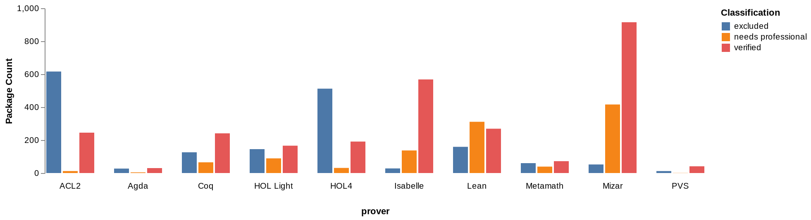
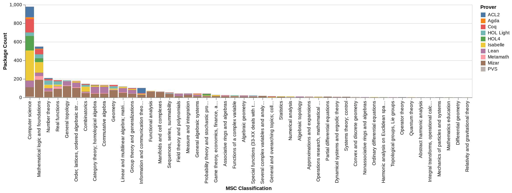
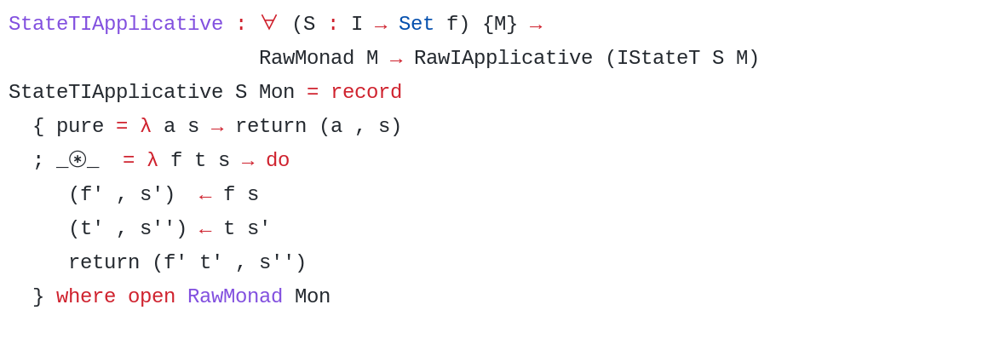
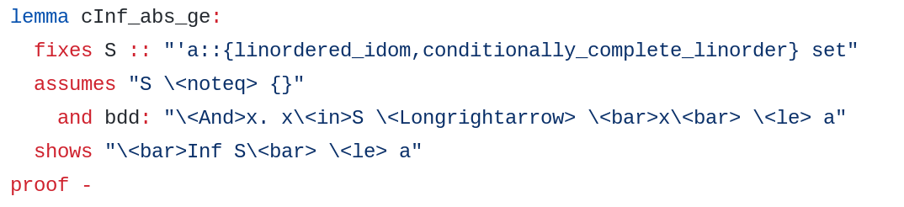
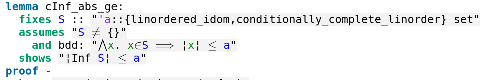
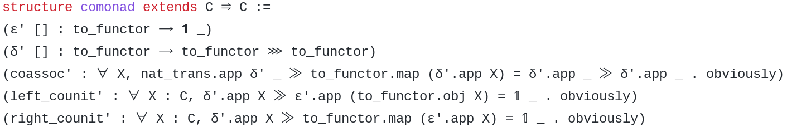
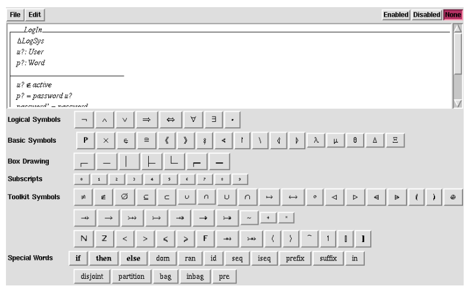

# Introduction
This is a thesis about **Interactive Theorem Provers**, what they are,
why they might be difficult to use, and whether you should explore using
them in your next project.

An **Interactive Theorem Prover** (ITP) or **Proof Assistant** is a piece
of software that helps a user prove mathematical theorems, or
equivalently, prove correctness properties about software. Some of the
more well known examples of ITPs include [Coq](https://coq.inria.fr/)
and [Isabelle](https://isabelle.in.tum.de/).

An ITP is often used by either a mathematician or an engineer. From the
side of a mathematician, ITPs allow users to specify a proposition that
they would like to prove, and then specify to the ITP how to construct
that proof of the proposition. The ITP can then check whether the given
proof is valid. Usually, when a proof in mathematics is made, it must be
checked for errors before being accepted. The use of an ITP automates this
verification, and means that the mathematician only needs to trust that
the ITP was implemented correctly in order to trust any proof that's been
created from it. By formalizing mathematics within ITPs, mathematicians
can create libraries of formal trustworthy proofs. This allows computers
to aid with the proof process, and helps improve the trustworthiness of
proofs. 

ITPs have been used for formalizing mathematics in the past. For instance,
the QED Manifesto [@QED_Manifesto] has proposed using ITPs to generate
computer checkable proofs for mathematics. Further, they have been used to
prove theorems such as the four colour theorem in Coq [@Four_Color] and
the Kepler Conjecture in a mixture of HOL Light and Isabelle [@Flyspeck].


An ITP can however also be used by a software engineer to create **certified
software**. **Certified software** is software that's been proven to operate
correctly, meaning that software is proven to operate as according to the
specification. When developing software, eradicating bugs is usually done
through procedures such as code reviews or software testing. However,
these will often not identify 100% of the errors. ITPs allow you to prove that the implementation matches the specification 100%. Proving the software
correct can give the assurance that the software implementation matches
the specification. This is a very high level of assurance in terms of
quality, and dramatically reduces the sources of errors in software. ITPs
have been used to ensure correctness of code bases that require a large
amount of trust, such as cryptographic libraries [@HACL], microkernels
[@Sel4] and compilers [@CompCert].


In computer science, often correctness proofs of algorithms (For example,
Dijkstra's algorithm [@DijkstraACL2] in an undergraduate context) are
described and proved to be correct on pen and paper. The use of an ITP is
analogous to this type of activity. Except that an ITP aids the user in
developing the proof, offering hints and/or automating portions of the
proof along the way. 

The task of creating verified software is split into two steps: first
specification and then verification.

During specification, the user specifies what it is that they would like
to prove, for example, that Dijkstra's algorithm always finds the shortest
path between one node and all other nodes in a weighted graph, assuming
positive weights. In this step, the user would create a specification for
what is Dijkstra's algorithm, graphs, and shortest paths. Then state that
Dijkstra's algorithm finds the shortest path. This step is far from
trivial, as developing a precise form of specification for software
requires having a detailed understanding of how exactly you want it to
work. Often within the verification process, a user might realise that the
specification itself is in error in some way, and might go back to correct the
specification during the process.

This specification leaves the user with a **proof obligation**. A proof
obligation is a onus on the user to prove that the specification of the
software is correct. Then, during verification, it is then up to the user
to provide to the ITP the reasoning as to why this proposition is correct.
This can be done in several ways, sometimes through the use of automated
software, or manipulating the proof by pointing and clicking, or
writing down a **proof script** that describes the steps made to prove the
theorem. Often this involves breaking down one proof obligation into many
other simpler proof obligations that can be solved individually.

The user and the ITP work together until they have specified a proof of
the statement they wish to claim. This is an iterative process where the
user may specify what they want to prove, then attempt to prove the
proposition, find out the proposition or the specification that they are
proving has a typo or error, fix the specification, continue developing
the proof, realise the approach of the proof won't work, backtrack and
start from an earlier state, realise they need to prove some auxiliary
lemma, create the lemma and prove that, come back to the original proof
etc. The ITP helps the user in the process by providing counterexamples
for propositions that may be incorrectly specified, automatically solving
some components of the proof, offering libraries of mathematical results
and informing the user of any errors in the reasoning of the proof. Once
that proof is made, assuming the ITP is functioning correctly and the
specification is correct, the user can be assured that the proposition is
true.

ITPs are often implemented by making use of a programming language, particularly
statically typed functional programming languages. A functional programming language is a language that creates problems from the composition and definition of functions, such as Haskell or OCaml. Often a goal in
creating statically typed functional programming languages is to create
languages where its difficult or impossible to make a certain class of
errors. For instance, Rust [@Rust] is designed to allow systems level
programming that's protected from memory errors, and Elm [@Elm] is
designed to create web programs that do not have runtime errors. This
means that possible software implementation errors are caught as they are
being typed checked, very early in the development process. ITPs can also
be seen as an extension of this by having type systems and features that
allow the user to go as far as proving arbitrary correctness properties
about the software.

More widespread use of ITPs is valuable as it allows for errors to be
caught much earlier in the development process. ITPs allow for errors in
specification or implementation to be found as the software as the
software is being developed. This prevents errors from arising when
testing or even worse, in production software. Such errors can be much
more expensive to fix [@CodeComplete]. 

## Formal Methods
ITPs are not the only way to specify and verify software. They belong to a
class of techniques named **Formal Methods**.

In essence, formal methods attempts to improve the process that users can
prove the correctness of their software systems. Use of formal methods can
be done without any tools at all, by simply proving properties manually, with paper and pencil, such as the Dijkstra example above [@Dijkstra].

However, when proving the correctness of larger systems, proving
properties by hand quickly becomes intractable. Computers and tools have
aided people in providing larger correction proofs for software systems.
The tools used in Formal Methods can be roughly divided into three
categories, Model Checkers, Automated Theorem Provers and Interactive
Theorem Provers. 

These three techniques are a trade off in three features. You can pick
two but not all three.

{#fig:formal_methods}

**Features of Formal Methods Tools:**

**Automation**: Whether finding a proof is fully automated. That is, the
user does not need to specify a proof manually for the proposition, the
system simply attempts to find one automatically.

**Termination**: Whether the tool terminates in a practical amount of
time when attempting to find a proof. For instance, does not have the
possibility of running for several days when attempting to prove a
proposition.

**Scope**: Whether the tool is able to prove any arbitrary property about
a system. The properties that can be proven are not restricted to a
subset of possible properties.

**Formal Methods Tools:**

**Model Checkers** are fully automated and if the specification is not
particularly large, can find solutions in a reasonable amount of time.
However, Model checkers can do this by restricting the scope of
the systems that they can prove. They allow for a specification for a
system in a (usually finite) state machine or automaton, and can prove
properties about this state machine. This means that you can only prove
with a model checker some simplification of the actual system, and often
cannot prove more complicated properties such as those with numbers. This
means that not all properties about the system can be verified.

**Automated Theorem Provers** (ATPs) are fully automated and can prove
arbitrary theorems, however may not terminate in reasonable time. For
larger systems or more complicated theorems, they may run forever and
never identify a proof or disproof for the proposition.

**Interactive Theorem Provers** terminate in reasonable time and can prove
arbitrary theorems. However, they are not fully automated, and require the
user's input to guide the proof of the theorem. This is a major limitation
as interacting with a human is often relatively slow and expensive. Especially if the propositions that are being proven are more trivial and could be solved quickly with an ATP.

The distinction between ATPs and ITPs is however not clear cut. ATPs can
often include minor user interaction in order to correct it's path and
find a proof. And ITPs often have automatic features and can even call
external ATPs to help automatically prove goals.

ITPs were chosen for this investigation due their usage in creating fully
certified software [@CertifiedSoftware]. Model checkers can be used to
check important properties about software, but can't get the last mile to
make it fully certified due to not allowing the user to prove all the
propositions that might be relevant to the code. As reliance on technology
is only getting greater, it's important to consider making technology as
trustworthy as possible, particularly if the software is
safety/security-critical.

That being said, ATPs are often used beside ITPs, where an ITP might call
an ATP to prove a proposition or discover a counterexample automatically.
The primary goal in the development of ATPs is the speed at which it can
prove a variety of theorems. As of such, development of ATPs directly influences development of ITPs by improving some of the automation related tools in ITPs.

## ITP Interaction Paradigms {#sec:interaction_paradigms}
ITPs can go about proving and specifying properties about software in different
ways. This section outlines a short history of interaction paradigms with ITPs,
and possible developments.

Direct Manipulation ITPs such as KeY work by editing proof objects until
the obligations have been resolved. These provers often have issues with
tedious interactions, and work has even been done add textual elements
to KeY [@beckert_interaction_2017]. The development of interfaces to
Direct Manipulation provers often differs from textual ones.

Textual ITPs such as HOL, Isabelle, Coq and Matita work by writing a
proof script that attempts to prove a proposition. Interacting with
textual ITPs often involves a very simple read-evaluate-print-loop (REPL)
for their interfaces. This is very similar to the example we went through
in section [@sec:using_an_itp]. One very stark example of this is
HOL-Light, which the user interacts with by opening up the OCaml REPL (a
general purpose ML based functional programming language) and loading the
HOL library. All OCaml is available alongside the HOL library. Although
this is rather primitive, modern ITP interfaces such as Isabelle/jEdit
and CoqIDE usually offer only a small layer of abstraction over a REPL
for their own languages.

These interfaces have two main windows, the first has code and the
second has proof state. The code can be evaluated up to a certain point,
and the output from the REPL in terms of proof state are printed in the
second window. The only major difference between this and a standard
REPL is that the user can rewind to evaluate up to a previous line. This
simple style of interface has consequences for usability. In particular,
if any error is found either in proof or in syntax, execution stops
until that error is resolved. Further, for larger projects, it can take
a very long time for systems to recompile. It also means that the user can
only reference things that have already been declared (it has to be a
single pass). This is particularly an issue when automated tactics
attempt to use lemmas above them to find solutions to theorems (such as
Isabelle). This means that simply changing the order of lemmas in an
Isabelle document, even if they never reference lemmas that are below
them, could cause a lemma that was proven before to become unproven.

Developments in IDEs to allow asynchronous interfaces, reloading only
parts needed and loading proofs out of order have been introduces to fix
this problem. They are called \"Prover IDEs\", with two examples being
Isabelle/PIDE [@wenzel_asynchronous_2014] and
Coq/PIDE [@barras_asynchronous_2015]. These hopefully will resolve some
of the issues cited above.

Although we have examples of large projects undertaken with ITPs, optimal
interaction paradigms are still up for debate, and several novel interaction
paradigms have surfaced. Including proving theorems and writing tactics with
diagrams [@grov_tinker_2018; @lin_understanding_2016; @shams_accessible_2018],
or providing agent based interfaces [@hunter_agent-based_2005].

We now move into the usability problems and solutions found in ITPs.

## Using an ITP {#sec:using_an_itp}
To explain the typical terms and issues related to ITPs, let us present 
an small toy example of using an ITP using pseudocode syntax.

Our pseudocode syntax is based on textual ITPs such as Isabelle, Coq and
HOL. The syntax is simplified to get the basic concepts of ITPs across
without too many of the technical details.

To prove a property with an ITP, the user must start by having a goal that
they wish to prove. You then manipulate and decompose that goal into
simpler subgoals, until they've proven the proposition they wish to prove.

We start with a function:

$$
f(x) = 
  \begin{cases}
    f(x - 1) + x, & x > 0 \\
    0, & x = 0
  \end{cases}
$$

This is the triangle number function. It adds a number to every number
below that number up until 0. For instance, $f(5) = 5 + 4 + 3 + 2 + 1 + 0
= 15$.

However, there is a quicker way to calculate the triangle number, and
that is that is that $f(x) = \frac{x(x + 1)}{2}$.

This proof is an elementary induction proof. But we shall demonstrate
that this statement is true.

We would like to prove that:

$$ f(x) = \frac{x(x + 1)}{2} $$

Textual ITPs are similar to interactive programming languages, such as R
and Bash, where the main interaction is through a Read Evaluate Print
Loop or REPL. You start by writing a line of code, and the ITP will
return the state. These lines of code manipulate the state until the
statement has been prover. After the proof, the user is left with a proof
script, which is a listing of all the code used to prove the proposition. 

To start with our proof, we first have to specify the property that we wish
to prove. In pseudocode, we write [@lst:proposition] into our ITP. This
statement says that the user would like to `Prove` the statement `forall
x, f(x) = x * (x + 1) / 2`. `Prove` here is a keyword that starts the
proof. Everything between the `:` and the `.` represent the statement
they wish to prove.

```
Prove: forall x, f(x) = x * (x + 1) / 2.
```

: User Input: Statement of the proposition to prove {#lst:proposition}

After writing this statement, the ITP will print the display shown in
[@lst:starting_state]. This will often appear in a window in the ITP
interface, or if it is a command line prover, it will print it to
console.

The state is separated into two sections, everything above the `---` is
an assumption, that is, what we have assumed to be true. We can have multiple
assumptions, but in this case, there are none. Then the statement below
the `---` is the **goal**. This is the statement  to prove. When starting
a proof, whatever statement the user wishes to prove becomes the first
goal, but both the assumptions and the goal will change as the user
progress in the proof. It's also possible to split the goal into multiple
subgoals as the proof is being developed. 

```
          
---
forall x, f(x) = x * (x + 1) / 2
```

: ITP Output: Starting state {#lst:starting_state}

Now we must give a series of **tactics** to the ITP to prove this
proposition. A tactic is like a command that is sent to the ITP in order
to prove the proposition that you wish to prove. Tactics are always typed,
and sometimes they fail to work in situations where their usage would be
invalid. These tactics form a language that you can use to specify your
proof.

It should be noted that while attempting to prove a proposition, the user may
wish to attempt to prove a goal or subgoal automatically. Most ITPs have the
ability to automatically prove simple propositions, often by giving the `auto`
tactic to the prover. If this succeeds, then the user is done and the
proposition is proven. Otherwise, the user must continue to explore proof
options. Furthermore, the ITP can assist the user by offering counterexamples
to why the proposition might not actually be true. We will assume that the
statement cannot be proven automatically.

This particular proof is often used as an introductory induction proof, so
induction would be a good start to solving this. Entering the pseudocode
in [@lst:induction_tactic] performs induction on the variable x. To
perform induction, we must prove the base case, and then prove the
inductive case. The ITP will ask to prove them one at a time,
starting with the base case. After the tactic is executed, the state of the
ITP will be modified, and display the state in [@lst:induction_state]. 

The state has now been split up into two *subgoals*. One for the base case
and one for the induction case, which is labeled as (1/2). In our pseudocode ITP,
all the tactics that we write will
manipulate the first goal only, but the ITP is indicating that there still is
a second goal that needs to be proven after this first one.
This means that the theorem prover is asking for a proof of the base
case, that is, that the statement is true when $x = 0$.

```
induction x
```

: Running the induction tactic {#lst:induction_tactic}

```
          
---
f(0) = 0 * (0 + 1) / 2
(1/2)
---
f(x) = x * (x + 1) / 2 -> f(x + 1) = (x + 1) * (x + 2) / 2
(2/2)
```

: State after the induction tactic {#lst:induction_state}

Notice that the tactic modifies the state of the ITP. Only tactics that
are valid at the time are allowed to be used, ensuring that all proof
steps are valid and construct a correct proof.

The base case is very easy to solve, as simply evaluating the function on
both sides ($f(0) = 0$ and $\frac {0 \cdot (0 + 1)}{2} = 0$) gives 0.

To evaluate this, we use the `simplify` tactic in [@lst:simplify_tactic].
This tactic attempts to try a list of rules that the prover guesses will
simplify the current statement. In our pseudocode ITP, this includes
evaluating statements with constants. The result is as we expect and
shown in [@lst:simplify_state]. Indicating that after the simplification,
both sides are equal to each other.

```
simplify
```

: Running the simplify tactic {#lst:simplify_tactic}

```
          
---
0=0
(1/2)
---
f(x) = x * (x + 1) / 2 -> f(x + 1) = (x + 1) * (x + 2) / 2
(2/2)
---
```

: State after running the simplify tactic {#lst:simplify_state}

Now the goal is to prove that `0=0`. This is trivially true because equality is
reflexive. As of such, we can prove the current goal by indicating that it's
reflexive. We can use the `reflexivity` tactic to prove any goal that is true
because of reflexivity. This tactic is executed in [@lst:reflexivity_tactic].

After we have solved the first goal, the base case, the pseudo-ITP is now
asking us to prove the inductive case in [@lst:reflexivity_state]. The current
goal is now to prove the inductive case. As it is with induction, the inductive
case allows us to assume that the original proposition is true for any x, and
that we need to prove that it is the case for x + 1. Therefore, the statement
for proposition for (x + 1) is our goal.

```
reflexivity
```

: Running the reflexivity tactic {#lst:reflexivity_tactic}

```
f(x) = x * (x + 1) / 2
---
f(x + 1) = (x + 1) * (x + 2) / 2
```

: State after running the reflexivity tactic {#lst:reflexivity_state}


The first step would be to replace `f(x + 1)` with it's definition.
This can be done with the `unfold` tactic, as shown in [@lst:unfold_tactic]. 
This tactic replaces a function with it's definition.
This replacement is shown in [@lst:unfold_state]

```
unfold f
```

: Running the unfold tactic {#lst:unfold_tactic}

```
f(x) = x * (x + 1) / 2
---
f(x) + (x + 1) = (x + 1) * (x + 2) / 2
```

: State after running the reflexivity tactic {#lst:unfold_state}

Our current assumption and the goal are equivalent statements in different forms.
We now have to re-arrange the goal to make it equal to the assumption.
This might involve several tactics to
manipulate the state of the equation. We will for the sake of brevity
written these tactics in English like code in
[@lst:rearangement_tactics]. The intermediate goals are shown in
[@lst:intermediate_states] to show the progress towards the desired goal,
and the final state is shown in [@lst:rearangement_state].

```
expand (x + 1) * (x + 2)
subtract both sides (x + 1)
replace (x + 1) with (2 * (x + 1) / 2)
combine fraction
simplify
factorise (x * x - x)
```

: Running re-arangement tactics {#lst:rearangement_tactics}


```
f(x) + (x + 1) = (x^2 + 3x + 2) / 2
f(x) = (x^2 + 3x + 2) / 2 - (x + 1)
f(x) = (x^2 x + 3x + 2) / 2 - ( 2 * (x + 1) / 2)
f(x) = (x^2 + 3x + 2 - 2 * (x + 1)) / 2
f(x) = (x^2 + x) / 2
f(x) = x * (x + 1) / 2
```

: States after running each tactic {#lst:intermediate_states}

```
f(x) = x * (x + 1) / 2
---
f(x) = x * (x + 1) / 2
```

: Final state after running each tactic {#lst:rearangement_state}

Because we know the inductive hypothesis is true, and the goal is exactly
the same as the inductive hypothesis, we can simply indicate that we have
proven the goal. We do this be the `assumption` tactic, and then close
off the proof with the `QED` tactic [@lst:assumption_tactic]. This then
accepts the proof as true [@lst:assumption_state].

```
assumption
QED
```

: Running the assumption tactic {#lst:assumption_tactic}

```
Proof accepted
```

: State after running the assumption tactic {#lst:assumption_state}

It should be noted that the tactic we wrote out are akin to deduction
rules, however, there is a problem with this approach, and the problem
should become clear once we write down all the commands that have been put into
the prover.

```
Prove: f(x) = x * (x - 1) / 2
introduce
induction x
simplify
reflexivity
unfold f
expand (x + 1) * x
subtract both sides x
replace x with (2 * x / 2)
combine fraction
replace ( + x - 2 * x) with ( - x)
factorise (x * x - x)
assumption
QED
```

: Final Proof script {#lst:final_proof_script}

These proof scripts are very difficult to understand statically, that is
it's difficult to formulate the reasoning behind the proof simply by looking at the list of tactics that were used to prove the proposition. Our
understanding of the tactic were aided due to our knowledge of the
current state, and understanding  However, when looking at the script without the context of
the state, they are often very difficult to follow. Especially if the
scripts are more complicated than this one.

## Cognitive Dimensions
Usability problems with ITPs have been noted in the past. In particular,
it was completed as part of Kadoda's PhD thesis in 1999
[@kadoda_formal_1997]. In their thesis, Kodada used Cognitive
Dimensions of Notation to classify and sort usability issues.
With ITPs.

Cognitive Dimensions of Notation is a framework proposed by Green [@green_usability_1996],
as a way of discussing the design trade-offs of visual programming
languages, but has been applied elsewhere for a variety of notations.
These dimensions are not an evaluation framework for notations, as often
increasing one dimension will also change other dimensions, and different
tasks may require different dimensions. For instance, in textual ITPs,
dependencies are not shown between theorems, and doing so would increase
the Diffuseness of the notation, allowing less to be shown and understood
on a single screen. However, debugging why some theorem might fail given a
change in other theorems would aid from a more diffuse representation
showing the hidden dependencies.

Cognitive Dimensions focus mainly on the way that users understand and
work with the meaning of the program. Cognitive Dimensions make an
important distinction between difficulties of understanding and working
with the notation vs. difficulties with the actual problem itself. Because
proving theorems is a very cognitively demanding task, and a lot of that difficulty is inherit to the problem of proving theorems, and no amount of notation will solve it. As of such, we need to focus on ways that the
notation can be improved to remove as many difficulties as we can that are not inherit.

Cognitive Dimensions of Notations has been adopted as a way of evaluating
the usability of ITPs in Kadoda PhD thesis [@kadoda_desirable_1999]. In
their thesis, they simply use the dimensions as a framework for
constructing a questionnaire about possible usability issues with ITPs. We
derive our definitions of Cognitive Dimension as applied to ITPs from her
thesis.

This thesis will be using Cognitive Dimensions of Notations framework to
classify different usability problems. The Cognitive Dimensions of
Notations and their definitions are presented:

**Abstraction Gradient**: Does the ITP offer ways of abstracting
components? Abstraction here refers to methods, classes and
encapsulation. Green classifies notations as either being
abstraction-hating, abstraction-tolerant or abstraction-hungry. An
abstraction-hating ITP would be one that forces the user to work with low
level constructs often. An abstraction-tolerant ITP would be one that
gives some methods for abstraction, but still nevertheless requires
constant low level interaction. An abstraction-hungry ITP would offer
many methods of abstraction, that could even in the end obscure what is
actually happening behind the scenes.

**Closeness of Mapping**: Closeness of Mapping is how similar the notation
is to the problem domain. At some point, a representation of the problem
has to be put into notation suitable for the ITP. The easier this is to do
the better the closeness of mapping, or how close the proof state is
represented vs what the user would expect.

**Consistency**: Once the user know the basics of an ITP, how much of the rest
can be inferred? A notation that is not consistent would require constant
lookup of features in the theorem prover. Consistency is particularly
important for learning ITPs. Consistency can become an issue when there
are a large amount of abstractions.

**Error-Proneness**: Is it easy to make careless mistakes? A common
\"careless mistake\" in theorem provers is trying to apply a tactic in a
textual theorem prover that is not valid for the current proof state.

**Diffuseness**: How much does it represent a proof relative to the
complexity of the proposition proven? This is an easier Cognitive
Dimension to measure, and represents the verbosity of the notation. ITPs
with high diffuseness often have lower abstractions and are easier to
understand, but more difficult to change.

**Hard Mental Operations**: Are there parts of the notation that require
getting out a pencil and paper to understand what it means? The domain of
ITPs by it's very nature requires Hard Mental Operations, so it's
important to separate the inherit difficulty vs difficulty created by the
notation. Hard Mental Operations may arise out of particularly complicated
tactics, especially since tactics can be composed together. An ITP with a
consistent set of tactics would reduce Hard Mental Operations.

**Hidden Dependencies**: Are there dependencies in the notation that are
not presented? In ITPs and programming languages, it's usually possible to
find what a function/lemma references, but is difficult to find what
lemmas/functions reference the one we are working in. Furthermore,
automation often uses lemmas in the context without indicating at all that
it is using them. This makes the issue of hidden dependencies even more
difficult. An ITP with low hidden dependencies makes these dependencies
between parts of the program explicit

**Perceptual cues**: Does the notation force the user to make decisions
before they have the information they need to make it? Especially for
novice users, ITPs need to allow the user to explore different paths for
proving a statement. This often represents a premature commitment as the
user has to commit to a strategy before evaluating whether that strategy
would work. ITPs that offer undo features and allow postponing making
decisions require less premature commitment.

**Premature commitment**: Does the notation force the user to make
decisions before they have the information they need to make it?
Especially for novice users, ITPs need to allow the user to explore
different paths for proving a statement. This often represents a premature
commitment as the user has to commit to a strategy before evaluating
whether that strategy would work. ITPs that offer undo features and allow
postponing making decisions require less premature commitment.

**Progressive Evaluation**: Does the system give adequate feedback? Error
messages, display of current proof state and ability to work with
incomplete proofs are all features of progressive evaluation. Getting
feedback from the system is absolutely essential for learning the ITPs.

**Role Expressiveness**: Is it easy to identify what the purpose of a
component is? Lack of role expressiveness, particularly within the proofs
of textual ITPs, was one of the main motivations of this study. It is
often very difficult on retrospect to identify how the components of a
proof relate to each other. An ITP with high Role Expressiveness would
make it clear how a lemma or component of a proof contributes to the
proof.

**Secondary Notation**: Are there avenues for comments, colours and
representation of the code that helps with comprehension? A Secondary
Notation is a way of representing understanding by not changing the actual
meaning of the notation. ITPs that offer comments, colours and whitespace
grouping help with representing secondary notation.

**Viscosity**: Is it easy to make a change in the system? ITPs with low
abstraction make it difficult to make changes. Sometimes a small
difference to what the user is wanting to prove requires a disproportionate
change of the proof. ITPs with high viscosity make it difficult to change.

**Visibility and Juxtaposability**: How easy is to get a particular piece
of desired information? How easy is it to compare part of the proof with
proofs elsewhere? Sometimes critical information is difficult to obtain
when creating or understanding a proof state. A common example is being
able to inspect intermediate proof steps. When a proof relies heavily on
automation, it is sometimes difficult to understand how the automated
tactic managed to get in a particular proof state. Having this information
helps understand the proof and how to move forward. ITPs with low
visibility make it difficult to find such information. Juxtaposability is
showing two parts of the system side by side. This is important as often a
proof might only be a refinement of a previous proof, and might need to be
understood in context.

## Research Questions

This thesis was inspired by the difficulty in reading static proof
scripts. Some provers have already moved to attempt to fix this problem.
For instance, Isabelle's Isar language offers a different way of proving
propositions that embeds more state, and helps the user understand the
proof. It would be therefore valuable to determine what usability issues
have been reported, what has been done to fix them, and whether solutions
from some ITPs could be used to help other provers.

And finally, the secondary motivation of this thesis is to encourage
further use and development of ITPs. So it would be valuable to create a
decision tool that helps a user determine which ITP, if any, should be
used for a particular
project.

Hence, the research questions for this thesis are:

RQ1 *{{RQ1}}* 

This research question was chosen to better understand the context of the
study. This was answered by a systematic literature review in
[@sec:literature_review].

RQ2 *{{RQ2}}*

This research question was chosen due to the continual development of
ITPs. It is answered by a living review in [@sec:results].

RQ3 *{{RQ3}}*

Finally, this research question was chosen as being important for the aim
of encouraging more development in the field of ITPs and the creation of
more verified software. It is answered by a living review in
[@sec:results].

# Methodology 
In this section, we go over the methodology for answering our research
questions. We will structure our systematic literature review, and outline
our contribution of a separate living review.

The natural method for answering RQ1 is to perform a systematic literature
review. This literature review intends to identify and categorize
usability issues related to different theorem provers. We outline the methodology for this review in [@sec:review_methodology].

Answering RQ2 requires going through the theorem provers and identifying
the issues.  However, ITPs are continually in development, and any issue
that arises could be solved at a future date. As of such, we created a
**living review** to answer this question.

A living review is a literature review of a field that updates
periodically to reflect the current state of the research. These reviews
are often published electronically, such as to a website. The goal of a
living review is to ensure that the review never goes stale, and can be
used as a reference years to come.

Our review looks through more than just literature, and attempts to directly
track progress towards fixing usability problems in ITPs. The methodology for
the living review is detailed in [@sec:living_review_meth]. This living review
will gather information about ITPs directly semi-automatically in order to
keep up to date. This living review is the main contribution in this thesis.

It differentiates itself from a normal review by updating automatically
over time, being an interactive software product, and existing as a
decision tool for users.

The creation of this living review will answer RQ3 and RQ2, and provide
descriptions of the current state of the field for ITPs.

## Systematic Literature Review Methodology {#sec:review_methodology}
In this section is to outline the methodology for our systematic
literature review. The goal is to answer RQ1, and identify usability issues in
literature.

To start, A preliminary ad-hoc literature review will be done in order to survey what usability
problems exist in ITPs. This preliminary review came from
a search for "usability interactive theorem provers\" on the ACM digital
library and Google Scholar. The review found several papers on the topic.
This will be done to better understand the keywords that people use when discussing
usability problems. We then attempted to construct a query that would match these papers and
also other papers in the field.

The query constructed from this process was as follows:

```
    ("Interactive" OR "Deductive") 
AND ("prover" OR "provers" OR "proving" OR "verifier") 
AND ("usability" OR "user" OR "users")`
```

This query has a large amount of quotes and exact text. The reason for this
is that both in many databases, looking up "prover" will return you papers
that include the much more common and less relevant term "prove". Further,
not quoting "usability" has the unfortunate consequence of returning papers that
contain the word "use". As of such, we have a very specific query.

We searched the following databases using this query string:

- Scopus 
- DBLP 
- Springer Link 
- Science Direct 
- ACM 
- IEEE
- Xplore

From the papers discovered in this way, we went through the abstracts and
discerned whether the paper was relevant to the research question.

Our inclusion criteria for the papers inclusion and exclusion criteria in the systematic literature
review were the following:

{{#latex}}
\begin{itemize}
\tightlist
\item[LIC1]
  A peer review published paper.
\item[LIC2]
  Notes particular usability issues with theorem provers OR\\
  Offers direct recommendations to the improvement of the usability of
  interactive theorem provers.
\item[LEC1]
  The paper is written in a lanugage other than english
\item[LEC2]
  The paper is of a tutorial, workshop, extended abstract.
\item[LEC3] the item is not peer reviewed.
\end{itemize}
{{/latex}}

{{#html}}
-   A peer review published paper AND 
-   Notes particular usability issues with theorem provers OR 
-   Offers direct recommendations to the improvement of the usability of interactive theorem provers
{{/html}}

From the papers that were deemed relevant to the research question, we
found papers that cited the papers discovered. That is, we applied forward
snowballing [@Snowballing].

We then tried to discover whether these papers were relevant to the
research question, and repeated the process of forward snowballing until
there were no more papers discovered.

We then analysed the identified papers to discover:

- The problems and/or solution to usability of interactive theorem provers
- Which theorem prover the issue is relevant to 
- Evidence behind issues and proposed solutions

The issues were then categorized by Green's Cognitive Dimensions of
Notations [@green_usability_1996]. This literature review therefore will answer RQ1. 

## Living Review Methodology  {#sec:living_review_meth}
The living review has the end goal of determining whether usability issues
still exist, and then further offering a tool to help decision about ITPs
(RQ3) but also answer whether usability issues still exist in the newest versions
of ITPs (RQ2).

The choice of what topics should be covered in the living review were informed
by the systematic literature review. All of these options for the scope of the
living review will be justified later. We chose to focus on three things:

Mathematical Scope. Does the library implement enough mathematical fundamentals?
Often it becomes difficult to work with theorem provers with small libraries,
as you may always have to go back to prove trivial things. Math scope is therefore
an important usability issue. This living review collects math modules from the
theorem provers and then classifies them. This allows for a good comparison between
the scope of different ITPs. This is the primary contribution of this thesis.

We further included a discussion of counterexample generators and math notation
as a minor contribution on top of this. Counterexample generators are software
that attempts to disprove the proposition you are trying to prove by providing
a counterexample. It does this so that you can identify if there are any problems
with your specification. Counterexample generators therefore help the user better
understand the proposition they wish to prove. This living review discusses the
support for counterexample generators among ITPs.

Finally, because proving software correct often requires the use of mathematics,
often being allowed to use mathematical notation can be useful to make it easier
to read and understand the items they are being asked to prove. The review includes
a discussion on support for mathematical notation.

The following sections describes the methodology in
detail. First, we discuss the choice of Interactive Theorem Provers
included within the review in [@sec:chosing_itps]. Then, we discuss the
methodology used in evaluating the scope of the library in
[@sec:scope_of_library_meth]. Then, we discuss the methodology for
evaluating support for counterexample generators in
[@sec:counterexample_meth]. Finally, we discuss the methodology for
evaluating support for math notation in [@sec:math_notation_meth].

### Choosing Interactive Theorem Provers to Cover {#sec:chosing_itps}
In this section, we discuss the choice of which ITPs to cover as part of the
living review.

A reasonable approach to this would be to reference a past review and borrow
their scope of ITPs. This was the approach that we took. The newest review
in the field is currently [@nawaz_survey_2019]. The ITPs 
in this review include {{nawazITPs}}.

However, we noted a couple of issues with this consideration of ITPs. In particular,
it seemed to favour reviews of older ITPs, and didn't include successful ITPs
that have come out more recently. 

One clearly missing consideration was that of Lean [@Lean], a highly popular
ITP that's more often used by mathematicians. Lean is mentioned within the review
as a 'newer ITP' but is not considered as part of the review. We chose to add Lean, particularly
because of its large community based mathematical library. It would be difficult
to make a comparison between mathematical libraries, as we intend to do, without
including this one.

Secondly, there were some provers that were included within this review that
are currently abandoned. Those two provers were Yarrow, and Watson.
These two provers had their last releases in 1999 and 2001 respectively. Considering the rate
of development of ITPs, these were removed due to meeting a very conservative
definition of being abandoned.

Finally, the last modification that was made was that the survey referenced
"HOL" as a theorem prover. HOL is not a single ITP but has several
implementations, including HOL4 [@HOL4], HOL Light [@HOL_Light], ProofPower
[@ProofPower] and HOL Zero [@HOL_Zero]. For the sake of their review, keeping
these separate was appropriate as only properties of different theorem provers
were discussed, and these properties remained largely the same for each
implementation. However, because this living review covers mathematical
libraries, which will change depending on the implementation, it will require
comparing between implementations. As of such, "HOL" was split into its two
most popular interventions, HOL4 and HOL Light. These two were chosen as they
have larger mathematical libraries, whereas HOL Zero and ProofPower do
not. Including HOL Zero or ProofPower would therefore not add much value to the
living review.

This left the following ITPS in scope for the review: {{citedItpNames}}.

### Scope of Library {#sec:scope_of_library_meth}
This section reviews the methodology for investigating the scope of libraries
within the living review. We have the goal of determining whether mathematical
foundations were covered for any given subject area, and by which provers they
are covered by.

On a high level, the mathematical libraries for different ITPs will be
decomposed into modules, and each of these modules are classified
according to which section of mathematics they cover. This way we can
identify which ITPs cover which mathematical topics, and make meaningful
comparisons between them.

{#fig:classification_summary}

The flowchart shown in [@fig:classification_summary] has an overview of
the methodology to be used used to evaluate the scope of the mathematical
libraries.

#### Step 1: Identifying Mathematical Libraries {#sec:identifying_math_lib_meth}

We start by identifying mathematical libraries. For the sake of this
analysis, we also include community contributions, such as package
management systems, as part of the scope. As of such, a "library" will
refer to both a library that comes along with an ITP (often titled a
"standard library") as well as a collection of community contributions,
such as package management system.

For each ITP, it will be determined whether they first had a body of code
similar to a library. If it did, then it was determined whether the
library simply meets the following inclusion criteria:

**IC1:** The library contains mathematical theorems. Libraries that do
not prove theorems are often libraries that are about simple constructions
of data types.

**IC2:** The library contains more than 15000 lines of proof code worth of math
theorems. This, as identified later, corresponds to about 10 modules. If the
library doesn't offer that many modules, then we consider this to not be of
interest to a mathematician.

For each ITP, we look for two different things. Firstly, whether the ITP has 
a mathematical library, and secondly, if the ITP has something resembling a package
management system. If the ITP had either or both of these things, then they
were decomposed into mathematical modules, as per the next section.

#### Step 2: Collecting Modules {#sec:collecting_modules_meth}

The next step is to determine what constituted a module for each of the
libraries. We define a **module** as a single unit of work contributed to
an ITP. This is used to reason about contributions and the scope of the
ITP. We define this concept as in our analysis we compare components of
standard libraries with packages in package management systems, so we refer to
a contribution under the same name.

A collection of resources can be of three types: "package", "small" or "large".
These are chosen to give a fair comparison between modules.

If the module came from a community contribution, such as Isabelle's
Archive of Formal Proofs or Coq's package management system, then it is
considered a "package" type. Meaning a module is considered to be whatever
a unit of contribution is. For instance, a package is considered a module
in Coq's package management system, or a submission in the Archive of
Formal Proofs. We consider this to be a natural mapping because there are very
little other options in defining a module in a package management system. It
would both be unusual to split up packages into their smaller components due to
having non standardised structure and also unusual to define a module as a
collection of packages. It also means that the module is understandable,
linkable and explorable in the review.

If the modules came from a "standard library", we attempted to divide the
standard library into "package sized" sections, in order to make a fair
comparison between contributions. Because a package, as above, is a
natural mapping to modules, and standard libraries are often much larger
than a single package, we need to split the library up in a way that makes each
component to a package. To do this, we exploited that most libraries
are structured in a hierarchy, so we split the library as determined by
how far down the hierarchy we need to go until we get "package sized"
sections. If only one level of the hierarchy is needed, it is classified
as "small", if two levels are needed, it is classified as "large". 

To determine whether a library is small or large, we first have a target module
size, which we define to be 1500 lines of proof code. Then, the mean module
size is calculated, and it is determined whether a small or large library is
closer to 1500 lines on a log scale. Whatever is closer we assign that size to
the library.

These modules are then collected from the internet automatically from the
webpage using a python script. The script is designed so that it can
update the review to newest modules automatically, ensuring that the users
are always viewing the most up to date version of these libraries.

This script will be run monthly to ensure that the review is up to date.

From the modules, a number of elements were collected. The name of the
module, a description if it was available, authors if it was available,
and a URL to the module. These will all be presented to the user when
discovering different modules supported by different ITPs.

#### Step 3: Classifying modules {#sec:classifying_modules_meth}

Our next step is to classify or exclude each module that we have collected. 

There are a number of exclusion criteria for this classification. These
exclusion criteria exist for modules that would be difficult or
impossible to classify as a part of a mathematical topic. Those possible
exclusion criteria include:

**EC1:** Utility, The module only offers a utility that is only relevant
to this ITP. For instance, many ITPs double as programming languages, so
any modules that allow for programming that works with the system such as
file operations are excluded. This also includes modules that are
integrations with other tools, or simply initialization libraries that
only reference other modules.

**EC2:** No Documentation, If the module doesn't have any documentation or
description of purpose, it is excluded from the classification. It should
be noted that the definition of documentation is very minimal in this
case. The module doesn't need to have much documentation, one sentence of
its purpose is enough. However, if it is missing, the module is difficult
to classify and is excluded.

**EC3:** Only Documentation: If the module is simply documentation and
doesn't provide any new resources, it is also excluded.

**EC4:** Deprecated: If the module has been marked or considered
deprecated, then it is also excluded.

Excluded modules will be marked as excluded, and the reason for exclusion
placed in the living review.

If a module doesn't fall under any exclusion criteria, then the modules is
ready to be classified. Each module is then assigned a mathematical
subject that it is relevant to.

The topics these modules were classified under come from the Mathematical
Subject Classification 2020 (MSC2020) [@msc2021]. MSC2020 is a
classification of mathematical subjects that is often used for mathematics
papers. Each topic is given a code representing its classification, One
such example of a code is 68P05, the code for work about data structures.
The code is split up into three sections, the top level is represented by
a top level mathematical field, For instance, the 68 in 68P05 means that
it's in the field of Computer Science. To refer to the general
field of Computer Science, it is referred to is 68-XX, with the -XX
meaning that it could be anything under this field. The next level of
classification is represented by a letter. In this case, the P in 68P05
refers to subclassification of "Theory of Data" under "Computer Science".
If one wishes to refer to the mid level classification, then one can do so
like 68Pxx, by replacing the final two numbers with "x"s. Finally, the
last two numbers represents the final level of classification. In this
case, the 05 refers to "Data Structures" under "Theory of Data" under
"Computer Science".

Some further examples of MSC Classifications are:

**68Nxx**: Theory of Software

**68N15**: Theory of Programming Languages

**13-XX**: Commutative Algebra

**13Axx**: General commutative ring theory

**13A50**: Actions of groups on commutative rings; invariant theory

This classification is chosen in order to be familiar to mathematicians,
and ensure that modules can be classified with enough specificity.

If the module also comes with some form of category (for instance, Coq's
package management system allows adding categories to a package,
indicating the subject it covers, or large library modules use the top
level module as a category), then the classification of the package is
"guessed". This is done by mapping the category to a classification. The
module can be browsed and seen in the tree, but however is marked as
"unverified". If the module doesn't come with a category, then the module
is marked as "unclassified".

Then, a module's description (for instance, abstracts, package
descriptions, names) is inspected manually and a classification is given
to it. The package is then considered to be "verified".

Finally, there is a limitation in our study, in that a very large number
of mathematical topics have been covered by ITPs. As of such, there are
some subjects that would require a very wide and professional
understanding of the many facets and areas of mathematics in order to
classify correctly. Any package that is therefore outside of the ability
of the author to classify, is labeled as "needs professional" during
verification. However, these modules are at the very least categorized
vaguely into a top level MSC classification. For example, the author
doesn't have a strong understanding of partial differential equations, so
any package that is from the field of partial differential equations is
marked as so, but not classified with any specificity beyond that.


This means that modules can be placed into five different states:

**Unclassified**: The module is included in the system, but
the system does not have any idea of what math classification it falls
under, nor has it been verified.

**Unverified**: The module's classification has been guessed automatically
based on a category provided by the resource providing the module. For
instance, Isabelle's Archive of Formal Proofs categorizes modules by
topic in their index, and the classification of the module is guessed
based on this.

**Excluded**: The module has been inspected and meets one of the exclusion
criteria. This excluded module is not classified and removed from the
study.

**Needs Professional**: The module has been verified but classified to a top
level. It requires a professional mathematician to classify more specifically.

**Verified**: The module has been verified manually to be in the correct classification. This is the final desired state of a module.

States that are **Unclassified** or **Unverified**
represents states that are incomplete. As in, at some later point, manual
intervention is required to "complete" the classification. The reason why
we discuss and include unclassified and unverified modules in the analysis
is that we would prefer to present all the resources available with a
prover to a viewer, even the newest resources, before a human goes into
the system to verify a package. The goal however, is to have no or little packages in the unclassified and unverified state.

A static snapshot of the work presented in [@sec:results] contain no
Unclassified on Unverified newer, but the living version of it may, as it
continues to collect newer module.

### Counterexample Generator Methodology {#sec:counterexample_meth}

When proving a theorem, a counterexample generator attempts to find an example for which the
theorem does not hold. This helps the user better understand when the
theorem and the statement that they wish to prove.

A literature review was performed in order to identify counter example
generators, and the ITPs systems that they have support.

This is a very minor contribution, but simply attempts to give a very
brief overview of support for counterexample generators for theorem
proving.

### Math Notation Methodology {#sec:math_notation_meth}

Finally, as another minor contribution, we include details about which theorem provers use mathematical notation in proving theorems.

Determining whether an ITP uses mathematical notation in proofs can easily
be done by examining example ITP code, and determining whether they use math
notation. Which ITPs support mathematical notation was further included
as a minor contribution to the living review.


### General features of about ITPs 
To compare between different ITPs, we must first start by collecting general features about them. This is tied in RQ3, as working out whether an ITP should be used on a project will require having some general information about it.

We decided to use a 2019 Systematic Literature Reviews on Theorem Provers
as our starting dataset [@nawaz_survey_2019]. This review went through 27
theorem provers and described the features that each prover had. This was
converted into a dataset and used to compare general features.

This dataset contained several properties about ITPs, and properties to
compare between them.

The full set of properties we used from the dataset are:

- What the ITP is based on (Syllogism, Type Theory, Etc)
- The logic of the ITP 
- The Truth value of the ITP
- Whether it supports Set theory 
- Whether it has a library 
- What the ITPs calculus is 
- Whether the architecture is modular or monolithic
- The programming language it's implemented in
- Whether it has a GUI or CLI interfaces 
- The Platforms its supported on (Windows, Mac, Linux)
- Whether it has an IDE 
- When it was first released. 
- Its latest release

A lot of these features (such as the logic, truth value etc) require
explanations as to what they refer to. These explanations will be included
within the tool. This allows people unfamiliar to the field to learn what the
components of ITPs are and why they are important.

Some newer ITPs were not included in the dataset, such as Lean, F* and Idris.
These were added manually to the dataset.

The systematic literature review we source our data from however, is already
out of date for the latest release of its provers. As of such, we have a python
script that automatically retrieves whether any newer versions of a prover have
been released by checking GitHub Tags. It gets the latest tag to be published
and adds that as the latest release on the living review, ensuring that the
review doesn't go out of date by having newer releases.

# Literature Review {#sec:literature_review}
The amount of papers found in each section of the review are shown in
[@tbl:litresults]. This totals to 36 papers found on the
topic.

There was a surprisingly small amount of papers caught by query in
comparison to snowballing. This is because many papers that discuss
usability issues about ITPs do not tackle the problem directly (28/38 of
the papers), but rather showcase a feature that has been coded into an
ITP interface. These features do indeed solve a usability problem
implicitly, and represent the bulk of the work on improving interfaces
for ITPs. However, comparatively little research has been done
identifying the issues with ITP interfaces and empirically comparing
these user interface modifications for merit (10/38 of the papers).

  Round        Found   Relevant
  ------------ ------- ----------
  Query        45      14
  Snowball 1   121     14
  Snowball 2   191     5
  Snowball 3   99      2
  Snowball 4   44      1
  Snowball 5   4       0
  Total        504     36

  : Literature review papers {#tbl:litresults}


When going through papers, it was interesting to find a large amount of
papers proposing user interface models, but not actually identifying the
problems that they solve, nor evaluating their effectiveness. In fact,
out of the 28 papers that showcased user interface improvements, only 2
papers evaluated the their interface improvement to without the
improvement [@hentschel_empirical_2016; @berman_development_2014]. That
there is not enough empirical studies verifying usability issues has
been cited as an issue that needs to addressed in the
past [@hahnle_deductive_2019].

The following sections outline usability issues and solutions to those
issues. Tables are included outlining the usability issues mentioned. If
the same problem is mentioned in two papers, it is given two rows.

The theorem prover column refers to the theorem prover the usability
issue was found in. If the problem is a general comment "General\" is
written. "Textual\" means a theorem prover that uses proof script to
solve theorems, such as Isabelle/HOL, Coq, Agda. "Direct Manipulation\"
means a theorem prover that uses direct manipulation to solve theorems,
such as KeY.

The discovered column indicates the evidence that that problem exists.
\"Suggested\" simply means that problem or solution was simply inferred
or has not actually been evaluated as effective. Other values indicate
the type of study that the paper used to observe or evaluate this
problem or solution.

## Theorem Provers

First of all, a brief overview of the theorem provers is in order.

#### KeY

KeY is a Direct Manipulation theorem prover, meaning that unlike Textual
theorem provers, does not prove theorems by writing proof scripts, but
instead works by modifying a proof object directly until all proof
obligations have been solved. KeY works by annotating Java programs with
preconditions and postconditions. These conditions are then fed into KeY
as proof obligations. KeY can act as a fully automatic prover, but also
allows the user to attempt to find a proof if the prover fails. KeY has
also formed the basis of KeYmaera and KeYmaera X, which are for proving
properties of hybrid systems.

#### HOL

HOL is actually a family of theorem provers. Notably HOL4, ProofPower,
HOL Light and HOL Zero. HOL is one of the oldest provers in this list,
and HOL Light is known to be used as a lightweight prover, with a very
easily checkable kernel. HOL provers are textual, and have a simple type
system and use tactics to prove propositions.

#### Isabelle

Isabelle (also known as Isabelle/HOL, but for this paper will remain as
Isabelle to prevent confusion) is one of the most popular theorem
provers. The prover has been used for the verification of the SeL4
prover, and exists as the state-of-the-art of ITPs. Isabelle like HOL
has a simple type system and is based of the Logic for Computable
Functions.

#### Coq

Coq is another popular ITP that also supports a dependent type system.
It's based on the Calculus of (Co)Inductive Constructions, which was
designed specifically for Coq. Coq has been used to prove the four
colour theorem, and create the CompCert certified C compiler.

#### Matita

Matita is a theorem prover based on Coq's Calculus of (Co)Inductive
Constructions, and was designed to address many of the pain points in
working with Coq. Matita is a much simpler prover that aims to present
the theorem prover as editing a mathematical library. As of such,
Matita's solutions to problems are often pain points in Coq
(mathematical notation, Tinycals etc).

There are a few other provers also in this review, such as iCon, CardiZ
and Dafny. These ITPs are often either coded as proofs of concepts (such
as iCon), or are no longer maintained (in the case of CardiZ or Dafny).
The problems raised by them however, are often relevant for current day
ITPs.

This is by no means a complete list of modern ITPs. Such compilations
have been done [@nawaz_survey_2019]. These are only the ITPs discussed
in the papers found in the review. There are notable ITPs that are
missing from this list that caught us by surprise, including Agda, Lean
and Mizar.


## Abstraction Gradient
The problems classified under abstraction gradient are shown in [@tbl:abstraction_gradient].

  Theorem prover   Problems                           Discovered     citation
  ---------------- ---------------------------------- -------------- ---------------------------
  KeY              Interaction with low level logic   Focus Groups   [@beckert_usability_2015]
  Isabelle         Missing Library                    Focus Groups   [@beckert_usability_2015]

  : Abstraction Gradient Problems {#tbl:abstraction_gradient}

The abstraction gradient Dimension concerns itself with the highest and
lowest levels of abstraction that are presented. Are they at the
appropriate level of abstraction?

Issues in this dimension were uncommon. KeY was found to require
interacting on low level logic formulas consistently. Similar issues
with tedious interactions with KeY are mentioned in the viscosity's
section. No solutions were found or suggested to this problem, and it
has not been empirically tested.

Focus Groups [@beckert_usability_2015] found that Isabelle's library lacks the appropriate
mathematical foundations. Interestingly, this is the only issue of this
class and is not mentioned elsewhere, often library issues are more
about managing and searching large libraries, which Matita attempts to
handle, and correct documentation of libraries. This has not been tested
empirically. Other than the implicit solution of providing better
library support for theorem provers, no solution has been provided for
this problem.

## Closeness of Mapping
The problems classified under Closeness of Mapping are shown in [@tbl:closeness_of_mapping].

  Theorem prover   Problems                                          Discovered     citation
  ---------------- ------------------------------------------------- -------------- ---------------------------------------------
  KeY              Unintuitive mapping between formula and program   Focus Groups   [@beckert_usability_2015]
  CardiZ           Cannot sketch out proofs                          Questionnaire   [@kadoda_cognitive_2000]
  Coq              Cannot use mathematical notation                  Survey         [@berman_development_2014]
  Coq              Cannot use mathematical notation                  Suggested      [@asperti_user_2007; @zacchiroli_user_2007]

  : Closeness of Mapping Problems {#tbl:closeness_of_mapping}

The dimension of Closeness of Mapping is whether the interface maps well
to the problem world. For interactive theorem provers, it has to do with
how well the proof state is understood in comparison to the actual
problem.

Focus groups [@beckert_usability_2015] found that because KeY attempts to
prove properties through annotations and java source code, it can
sometimes be difficult to see how this proof state maps to the
program [@beckert_usability_2015]. This issue is not mentioned in any
other source and not tested empirically. No solutions have been suggested
for this.

CardiZ, an ITP that can be used to prove properties of Z specifications,
found that the user could not sketch out proofs before an attempt
[@kadoda_cognitive_2000]. This is the only paper on CardiZ, as CardiZ is
not a popular prover. No solutions have been suggested for this.

A common issue that came up with Coq was the inability to use mathematical
notation
[@berman_development_2014;@asperti_user_2007;@zacchiroli_user_2007].
Notation issues are problematic in ITPs. One one hand, theorem provers
such as Isabelle and Agda allow using mathematical notation in their
theorems. This helps the user understand the theorem in a terse syntax. On
the other hand, mathematical notation can often be ambiguous and difficult
to type. Isabelle allows using LaTeX style commands such as `rightarrow`
to render math notation, whereas Agda allows Unicode in source files. In
order to avoid ambiguity, Coq has no support for math notation, and in
response to this, Matita has LaTeX style mathematical
notation [@asperti_user_2007; @zacchiroli_user_2007]. This issue came up
in three different sources.

## Consistency
The problems classified under Consistency are shown in [@tbl:consistency].

  Theorem prover   Problems                                           Discovered      citation
  ---------------- -------------------------------------------------- --------------- ------------------------------------------------------
  Isabelle         Difficult to know what tactics and lemmas to use   Focus Groups    [@beckert_usability_2015; @beckert_interaction_2017]
  HOL              Difficult to know what tactic to apply next        Suggested       [@aitken_interactive_1998]
  Isabelle         Hard to remember prover specific details           Suggested       [@nagashima_pamper_2018]
  KeY              Difficult to know what tactic to apply next        Suggested       [@mitsch_keymaera_2017]
  Isabelle,HOL     Difficult to remember names of theorems            Observational   [@aitken_analysis_2000]
  Coq              Difficult to find relevant lemmas                  Survey          [@berman_development_2014]
  Coq              Difficult to find arguments for tactics            Observational   [@ringer_replica_2020]
  Coq              Bad Library, inconsistent naming                   Survey          [@berman_development_2014]

  : Consistency Problems {#tbl:consistency}

Consistency is the Cognitive Dimension of whether, once learning part of
the notation, the user is able to infer the rest of the notation.

In textual theorem provers, it is often difficult to remember the name
of the next tactic, theorems or lemmas should be applied in any
situation. This has been bought up in focus
groups [@beckert_usability_2015], observational
studies [@aitken_analysis_2000], surveys [@berman_development_2014] and
suggested as a problem from various other sources.

Solutions to this problem often include choosing applicable tactics by
menu [@aitken_analysis_2000; @aitken_interactive_1998] Which has been
implemented in Coq through Proof Previews [@berman_development_2014] and
in KeYmaera X [@mitsch_keymaera_2017]. Machine learning for choosing
appropriate recommendations has been suggested for this
problem [@ringer_replica_2020], and has also been implemented through
the PaMpeR tool in Isabelle [@nagashima_pamper_2018]. A second way of
tackling this problem is to improve library searching, which was
suggested [@aitken_analysis_2000] and is a focus in
Matita [@tassi_interactive_2008]. Improving these tools is a promising
area for improving the usability of ITPs

## Diffuseness / Terseness
The problems classified under Diffuseness/Terseness are shown in [@tbl:diffuseness].

  Theorem prover   Problems                                  Discovered      citation
  ---------------- ----------------------------------------- --------------- ---------------------------
  Isabelle         Bloated Formulas                          Focus Groups    [@beckert_usability_2015]
  Isabelle         Large proofs correspond to large effort   Observational   [@bourke_challenges_2012]

  : Diffuseness / Terseness Problems {#tbl:diffuseness}

Diffuseness is the Cognitive Dimension of the tersity/verbosity of the
syntax. Bloated formulas were mentioned in Isabelle in Focus Groups, and
projects with more lines of code were strongly correlated with more
effort. No solutions have been suggested to reducing the size of code
bases or formulas.

## Error Proneness
The problems classified under Error Proneness are shown in [@tbl:error_proneness].

  Theorem prover   Problems                                           Discovered      citation
  ---------------- -------------------------------------------------- --------------- ---------------------------
  Isabelle,HOL     Easy to get errors in Object Level Constructions   Observational   [@aitken_analysis_2000]
  Isabelle,HOL     Incorrect predictions made about tactics           Observational   [@aitken_analysis_2000]
  Isabelle         Difficult to manage namespace                      Suggested       [@bourke_challenges_2012]

  : Error Proneness Problems {#tbl:error_proneness}

Error proneness is the Cognitive Dimension of whether a system allows
its users to make errors.

Observational studies have found that in Isabelle and HOL it is easy to
make errors in syntax. Considering the frequency of syntax errors, this
issue came up surprisingly little other sources. This could be because
syntax errors are relatively easy to fix and also decrease with usage.
It's been suggested that this problem could be solved my improving
feedback in Object Level syntax input [@aitken_analysis_2000]. A more
interesting solution has been implemented for Coq is a structure editor
based off keyboard cards [@berman_development_2014]. This uses rolling
chords (like *vi*) keyboard interfaces to interact with the theorem
prover. This means that it is only possible to enter syntactically valid
statements. This current solution only works on a subset of Coq's
syntax. It was found to be slightly quicker than using dropdown menus.

Sometimes when applying a tactic, an unexpected result would occur,
causing the user to back up and try to understand the current state.
This issue could be solved by Proof Previews [@berman_development_2014],
which allow the user to see a proof state when selecting tactics from a menu
without actually applying the tactic. That way the user can cheaply
explore tactics to continue in the proof.

Finally, for large verification projects such as SeL4, there is an issue
with managing the namespaces of large amounts of theorems and lemmas. No
verification of this problem nor solution has been suggested.

## Hard Mental Operations
The problems classified under Hard Mental Operations are shown in [@tbl:hard_mental_operations].

  Theorem prover   Problems                                      Discovered   citation
  ---------------- --------------------------------------------- ------------ ----------------------------------------------
  Coq              Hard to understand proof scripts statically   Suggested    [@zacchiroli_user_2007]
  General          Difficult to understand tacticals             Suggested    [@grov_tinker_2018; @lin_understanding_2016]
  General          Proof scripts can become complicated          Suggested    [@aspinall_towards_2016]

  : Hard Mental Operations Problems {#tbl:hard_mental_operations}

The Dimension of Hard Mental Operations refer to the difficulty in
understanding and using the interface on a syntax level. This type of
issue is common with ITPs, as the actual domain is complicated, so this
is reflected with difficult syntax.

Proofs are hard enough to understand while viewing the dynamic nature of
the proof, investigating proof state bit by bit. They are often near
impossible to understand statically [@zacchiroli_user_2007]. This issue
has not been investigated empirically, but solutions often involve
changing the syntax around proofs. One notable example of this is Isar
for Isabelle [@wenzel_structured_2006], which attempts to mirror how a
pen and paper proof is structured.

It is often difficult to understand tacticals, and the problem is made
even worse when it is not possible to view the state of a tactical mid
way through interaction. This problem has been suggested in several
sources [@grov_tinker_2018; @lin_understanding_2016; @zacchiroli_user_2007]
but never empirically investigated. Solutions to this include
representing tacticals as
graphs [@grov_tinker_2018; @lin_understanding_2016]. This solution has
not been tested with users.

Proof scripts can also get very complicated for larger propositions.
Keeping track of this complexity has been suggested with proof metrics,
which are similar to classic code complexity
metrics [@aspinall_towards_2016].

## Hidden Dependencies
The problems classified under Hidden Dependencies are shown in [@tbl:hidden_dependencies].

  Theorem prover   Problems                                               Discovered   citation
  ---------------- ------------------------------------------------------ ------------ ---------------------------------
  Isabelle         Hard to see dependencies between proofs                Suggested    [@spichkova_human-centred_2017]
  KeY              Difficult to patch proofs that have slightly changed   Suggested    [@beckert_evaluating_2012]
  Isabelle         Hidden automation dependencies                         Suggested    [@bourke_challenges_2012]
  Isabelle         Difficult to patch proofs when dependencies change     Suggested    [@bourke_challenges_2012]
  Isabelle         Hard to see dependencies between proofs                Suggested    [@aspinall_towards_2016]

  : Hidden Dependencies Problems {#tbl:hidden_dependencies}

Hidden Dependencies represent dependencies between components that are
not shown explicitly. Hidden dependencies are everywhere in theorem
provers. Like functions in many programming languages, lemmas can
reference the lemmas that they use, but it is difficult to find where a
particular lemma has been used. Automation makes this problem even
worse, where in Isabelle, an automatic tactic will try lemmas that are
above it in the theory. This makes moving lemmas around a theory
document difficult. Moving a lemma around a document, even if all the
other lemmas it is references are above it, may cause it to fail due to
it using a lemma by automation. Monitoring dependencies has been
suggested as part of formal proof metrics. It's been suggested and
implemented within CoqPIE to show these dependencies within the
IDE [@roe_coqpie_2016]. Tools have also been built to analyse
dependencies between Isabelle proofs [@spichkova_human-centred_2017].
For automated tactics, Isabelle's sledgehammer offers a unique solution
to showing dependencies. The automatic tactic, after execution, simply
prints a set of manual tactics that were used to prove the theorem into
the document. That way, all the lemmas that were used in the automated
tactic are made explicit [@bourke_challenges_2012]. None of these
solutions have been empirically tested for validity.

Furthermore, often changing a definition or proof slightly requires
changing the proof in order to match the new definitions. This is a
tedious process.

None of these issues have been tested empirically.

## Perceptual Cues
The problems classified under Perceptual Cues are shown in [@tbl:perceptual_cues].

  Theorem prover   Problems                              Discovered   citation
  ---------------- ------------------------------------- ------------ -------------------------------
  HOL              Difficult to understand proof state   Suggested    [@kadoda_cognitive_2000]
  KeY              Difficult to understand proof state   Suggested    [@hentschel_integrating_2016]
  General          Difficult to understand proof state   Suggested    [@eastaughffe_support_1998]

  : Perceptual Cues Problems {#tbl:perceptual_cues}

Perceptual Cues is how easy it is to understand what is being
represented. Understanding proof state is an enormous part of theorem
proving. The normal solutions to understanding proof state are to offer
more ways of viewing it, and ensuring easy access to these views. As of
such, solutions are found in the visibility section.

## Premature Commitment
The problems classified under Premature Commitment are shown in [@tbl:premature_commitment].

  Theorem prover   Problems                                                  Discovered   citation
  ---------------- --------------------------------------------------------- ------------ ----------------------------
  HOL              Need to redesign model if proof attempt fails             Suggested    [@beckert_usability_2015]
  Coq              Have to apply tactics before understanding what they do   Suggested    [@berman_development_2014]

  : Premature Commitment Problems {#tbl:premature_commitment}

When an attempt to prove a theorem fails, either one of two things has
happened. First, the proof the user are attempting to perform is incorrect,
or the model itself is in error. The model is often in error, and as of
such there is a Premature Commitment to a model before having a full
understanding. Counterexample generators such as Quick Check and
nitpick [@beckert_usability_2015; @beckert_interaction_2017] for
Isabelle help prevent the user from trying to prove improvable lemmas by
providing the user with a counterexamples to show why their lemmas can't
be true.

Furthermore, tactics often need to be applied to discover what they do.
Typing out this tactic is part of the exploration, and represents
another premature commitment. A cheaper way to explore tactic
applications were trialed with Proof previews in
Coq [@berman_development_2014]. These proof previews allowed the
selection of the next tactic by menu, and hovering over a tactic
previewed it's application in a separate window. This was found to be
helpful with users.

## Progressive Evaluation
The problems classified under Progressive Evaluation are shown in [@tbl:progressive_evaluation].

  Theorem prover   Problems                                                    Discovered   citation
  ---------------- ----------------------------------------------------------- ------------ ---------------------------------------------------------------------------------
  General          Hard to understand why proof state fails                    Suggested    [@hentschel_interactive_2016]
  KeY              Hard to understand why proof state fails                    Suggested    [@beckert_interaction_2017; @beckert_interactive_2015; @beckert_usability_2015]
  Dafny            Hard to understand why proof state fails                    Suggested    [@grebing_seamless_2020]
  KeY              Hard to understand why proof state fails                    Suggested    [@lin_understanding_2016]
  General          Hard to understand automated tactics                        Suggested    [@mitsch_keymaera_2017]
  e General        Not enough feedback hinders learning                        Suggested    [@mitsch_keymaera_2017]
  Coq              Lack of background automation                               Survey       [@berman_development_2014]
  General          Lack of background automation                               Suggested    [@hunter_agent-based_2005]
  KeY              Bad feedback hinders learning                               Survey       [@beckert_evaluating_2012]
  Coq              Don't know whether an automated tactic would prove a goal   Survey       [@berman_development_2014]
  Isabelle         Non reactive interfaces                                     Suggested    [@beckert_usability_2015]
  Isabelle         Hard to understand errors from bad inferences of types      Suggested    [@beckert_usability_2015]
  Isabelle         Performance of automatic strategy                           Suggested    [@beckert_usability_2015]
  Isabelle,KeY     Difficult to understand automated strategy                  Suggested    [@beckert_usability_2015]

  : Progressive Evaluation Problems {#tbl:progressive_evaluation}

Progressive Evaluation is the Dimension of getting appropriate feedback
from the system.

Not understanding why proof attempts fails in a widely cited example of
this. This becomes especially true when automation is added to the mix.
Insight to the operation of automated tactics is missing in many ITPs.
This has been suggested to be one of the largest issues with the
usability of ITPs in Focus Groups [@beckert_usability_2015]. Although
there is little empirical evidence of this issue, the fact that it is so
widely cited indicates importance. Solutions to this issue often resolve
around providing better visibility, and are covered there.

Other issues include that systems with low feedback make it difficult to
teach using ITPs, and that ITPs do not effectively use background
processing to provide the user with feedback. One way of improving
feedback is using a cache of proof
state [@berman_development_2014; @bourke_challenges_2012]. Another more
novel way is to provide an agent based interaction
model [@hunter_agent-based_2005], where the user interfaces have a
\"Personal assistant\", who then negotiates with proof agents to help
solve a particular proof. This makes best use of background processing
while the user is trying to solve a problem. Neither of these have been
tested with users.

Finally, it was mentioned in a survey of Coq users that it would be nice
to know in advance whether an automated tactic could prove a goal. This
would prevent further unnecessary work.

## Secondary Notation

Secondary Notation is the realm of comments, documentation, and even use
of visual placement to convey meaning. Problems due to lack of secondary
notation are usually simply because of missing features, and are
therefore more naturally discussed as solutions.

The problems classified under Secondary Notation are shown in [@tbl:secondary_notation].

  Theorem prover   Intervention                               Discovered   citation
  ---------------- ------------------------------------------ ------------ ----------------------------
  HOL              Allow notes in tree contexts               Suggested    [@aitken_interactive_1998]
  Isabelle,HOL     Allow adding notes to proof context        Suggested    [@beckert_evaluating_2012]
  Isabelle         Add document orientated features           Suggested    [@wenzel_isabelle_2011]
  Isabelle         Gravity for automated lemma placement      Suggested    [@bourke_challenges_2012]
  Isabelle         Deprecation tags                           Suggested    [@bourke_challenges_2012]
  Coq              Doc comments                               Survey       [@berman_development_2014]
  HOL/CardiZ       Colour and low secondary notation          Survey       [@kadoda_cognitive_2000]
  Coq              Lack of good tutorials and documentation   Survey       [@berman_development_2014]
  KeY              Poor documentation                         Suggested    [@beckert_evaluating_2012]
  Isabelle         Better libraries and documentation         Suggested    [@berman_development_2014]

  : Secondary Notation Solutions {#tbl:secondary_notation}

One improvement on secondary notations is the ability to note and label
parts of proof context. Usually, proof context is boxed off and cannot
be documented other than basic comments. Interestingly, although this
feature is cited multiple times. It remains, to the best of my
knowledge, unimplemented, and as with the rest of the solutions in this
category, untested.

Document oriented proof organization tries to make each theory readable
both to a human and to a computer, and involves allowing linking to
external theories, websites, diagrams and other features all in the
prover editor. This is commonly done with web interfaces controlled by
ITP code. This method has not been investigated as being beneficial, but
Matita itself was built to support this style of interaction.

Features such as deprecation tags, doc comments and automatic naming of
lemmas frequently showed up. These indicate that it is important for the
user to break out and write hints to help themselves and others navigate
their code. These have been implemented in some provers, but again, have
not been tested.

Finally, a very common issue with ITPs is the lack of tutorials and
documentation, particularly around library functionality. This is
remarkably important, regardless of what the prover is.

## Viscosity
The problems classified under Viscosity are shown in [@tbl:viscosity].

  Theorem prover        Problems                                            Discovered     citation
  --------------------- --------------------------------------------------- -------------- ---------------------------------------------------------
  Isabelle              Messy Downwards compatibility                       Focus Groups   [@beckert_usability_2015]
  Isabelle              No support for proof refactoring                    Focus Groups   [@beckert_usability_2015]
  Direct Manipulation   Tedious Interactions                                Suggested      [@grebing_usability_2020; @beckert_usability_2015]
  General               Hard to make effective use of large library         Suggested      [@asperti_considerations_2010; @tassi_interactive_2008]
  Isabelle              Tacticals difficult to write                        Suggested      [@becker_lassie_2021]
  Coq                   Have to update proofs once definition changes       Suggested      [@ringer_replica_2020]
  Coq                   Proof renaming and refactoring is tedious           Suggested      [@ringer_replica_2020]
  Coq                   Large proof scripts require too long to recompile   Suggested      [@barras_asynchronous_2015]
  Isabelle              Large proof scripts require too long to recompile   Suggested      [@wenzel_asynchronous_2014]
  Coq                   Difficult to select terms                           Survey         [@berman_development_2014]
  Coq                   Unnecessary re-running of proofs                    Survey         [@berman_development_2014]
  Coq                   Slow for large proofs                               Suggested      [@roe_coqpie_2016]
  Coq                   Change in lemma requires change in proof            Suggested      [@roe_coqpie_2016]
  KeY                   Bad change management                               Suggested      [@beckert_evaluating_2012]
  KeY                   Bad Automated proof performance                     Suggested      [@beckert_evaluating_2012]
  KeY                   Hard to decompose proof                             Suggested      [@beckert_interactive_2015]

  : Viscosity Problems {#tbl:viscosity}

Viscosity is the Cognitive Dimension of the ease of changing the state
of the programs.

One source of viscosity is simply performance. As automatic strategies
get more complicated, their performance becomes important for them to be
useful to the user. This has been suggested by focus groups and in
surveys. This becomes a particularly difficult problem especially for
larger systems. Attempts to improve performance have been done by
asynchronously loading only required parts of the proof in
Coq [@barras_asynchronous_2015] and
Isabelle [@wenzel_asynchronous_2014]. Improvements to performance of
automatic strategies will always be an
improvement [@bourke_challenges_2012], including making better use of
the library [@tassi_interactive_2008; @asperti_considerations_2010].

A second source is the need to make trivial interactions when making
small changes. For instance, the renaming of a lemma require needing
to go through several files to find where to change the identifier.
Messy downwards compatibility, changing definitions, and lack of
refactoring are all examples of this. These are usually addressed by
refactoring tools that have been suggested as
necessary [@ringer_replica_2020; @bourke_challenges_2012] and
implemented in some IDEs such as CoqPIE [@roe_coqpie_2016]. These
solutions have not been tested with users.

The third is simply interactions that are tedious and error prone. This
is more common in direct manipulation theorem provers such as KeY. No
solutions have been suggested for this problem.

Finally, the fourth source of viscosity is clunky syntax, such as the
need to explain selections to the theorem prover. Selections are a
common issue when describing the part of the goal that the user
wants to rewrite. This part might be complicated, but has to be
represented textually. This has served as a challenge for ITP designers.
Selections using patterns has been implemented in
Matita [@zacchiroli_user_2007; @asperti_user_2007] to address this pain
point.

## Visibility
The problems classified under Visibility are shown in [@tbl:visibility].

  Theorem prover   Problems                                            Discovered     citation
  ---------------- --------------------------------------------------- -------------- ----------------------------
  KeY              Proof tree too detailed                             Focus Groups   [@beckert_usability_2015]
  Textual          Limited insight to automated tactics                Suggested      [@grebing_usability_2020]
  HOL              Hard to understand proof tree                       Suggested      [@aitken_interactive_1998]
  HOL              Allow showing and hiding of proof contexts          Suggested      [@aitken_interactive_1998]
  Coq              Cannot see intermediate proof states                Suggested      [@zacchiroli_user_2007]
  Coq              Difficult to see structure of proof tree            Suggested      [@berman_development_2014]
  Coq              Cannot see the relation between subgoals            Survey         [@berman_development_2014]
  Coq              Cannot quickly see type or simplification of term   Survey         [@berman_development_2014]
  KeY              Bad presentation of incomplete proofs               Suggested      [@beckert_evaluating_2012]

  : Visibility Problems {#tbl:visibility}

Visibility was a commonly cited issue with interactive theorem provers.

The Cognitive Dimension of visibility has to do with being able to how
information can be identified and accessible to the user. For the case
of interactive theorem provers, there were cases where theorem provers
show too much or too little information.

Direct manipulation theorem provers such as KeY were found to show too
much information in the proof tree, which overwhelms the user trying to
work out why a proof attempt has failed. The simplest solution to this
is to only show information needed [@eastaughffe_support_1998] and allow
the opening and closing of views [@aitken_interactive_1998]. However,
some IDEs (such as CoqIDE) come without a proof tree. These have been
considered helpful [@berman_development_2014; @aitken_interactive_1998]
and have been implemented with Traf [@kawabata_traf_2018]

In contrast, it's also been claimed that there is a lack of visibility
of the proof state, particularly intermediate proof states within
textual theorem provers. The lack of visibility is often to do with
intermediate proof states. An intermediate proof state is the state that
a proof is in before the full completion of a tactic, and can be used to
determine how a tactic got to a particular proof state. Understanding
these intermediate proof states is important in understanding the
process of automatic theorem provers and the current state. Viewing
intermediate proof states is not possible with Isabelle/HOL or Coq. In
fact, it is not even possible to investigate the inside of tacticals
making it even more difficult to understand intuitively a proof. The
tactical problem has been resolved by only using a subset of tacticals
with Matita's Tinycals [@asperti_user_2007; @zacchiroli_user_2007].
KeYmaera X also offers traceability with automatic tactics, allowing
insight to the operations they performed [@mitsch_keymaera_2017].

In one of the only empirical tests of two different user interfaces, an
interface akin to a symbolic debugger is compared against the standard
interface of
KeY [@hentschel_integrating_2016; @hentschel_empirical_2016; @hentschel_interactive_2016].
The symbol debugger was found to be easier to use. The interfaces are
very different, and it could be for a variety of reasons. One such
reason is that the interface of a symbolic debugger maps better onto the
context of source code, and offers visibility of that connection.
Offering different ways of viewing and interacting with proof state has
been suggested as a way forward in the usability of
ITPs [@eastaughffe_support_1998; @grebing_seamless_2020].

Diagrammatic representations of proof is an alternative way of proving
theorems, as demonstrated with iCon [@shams_accessible_2018] and Proof
Transitions in CoqEdit [@berman_development_2014]. This has not been
tested empirically against other ITPs

## Analysis

Many problems were identified. A summary of the problem is tabulated in [@fig:usability_issues].

{#fig:usability_issues}


This analysis finds that although many issues were identified, there is
very little empirical research on these problems. This is probably due to
the difficulty in recruiting expert participants to these studies, and the
small size of the field.

An empirical analysis of all of these problems is well and truly outside
the scope of this thesis. The task at hand is to now select problems that
can be addressed.

The first thing to consider is that we are creating a living review. Many
of the usability issues that arose have a strong human component. For
instance, "Hard to predict the results of tactics" would be very difficult
to evaluate without performing a usability test. If we were to include a
measure within the living review that required the conducting of a
usability test, the usability test would need to be run on a periodic
basis to keep it up to date with the current state of technology. This is
highly undesirable, as such a project would be extremely time consuming
and expensive, and would require a time and money investment for years
after this thesis is published.

To address this, we restrict this thesis to usability issues that can be
determined to exist without the highly expensive intervention of a user.
This leaves the following options:

 - Scope of Library
 - Math Notation support
 - Counterexamples
 - Performance

All these issues beside performance are within the scope of our living
review. Although creating a living review for ITP performance that
automatically updates is technically feasible, we determined that this was
not a usability problem of interest in comparison to the large amount of
effort and money (setting up a list of standard activities, setting up of standardised hardware, running programs in test harnesses) required to include performance the review's scope. 

# Results {#sec:results}
In this section, we discuss in detail the living review that we have
contributed. This section is only a static snapshot of the review at its
current stage. The full living review is available online and will be
fully up to date. Therefore, it should be noted that the living review
itself contains all the information found in this section and more. If you
wish to view the results as it is up to date, then we invite you to look
through the online widget.

{{#html}}
As you are viewing this via the web, the widget is embedded below for you to explore:
<div id='itps'></div>
{{/html}}

{{#latex}}
The widget can be explored from the following:
[https://samnolan.me/thesis/review.html](https://samnolan.me/thesis/review.html)
{{/latex}}

The source code for this thesis, the widget, and all the code behind it
are also available on GitHub at
[https://github.com/Hazelfire/thesis](https://github.com/Hazelfire/thesis).
What follows is a snapshot of the findings in the review.

The following {{itpCount}} ITPs were included in the review:
{{citedItpNames}}.

The results are split into three sections. In [@sec:math_libraries],
results about the state and scope of mathematical libraries of ITPs are
discussed. In [@sec:counterexamples] results about the support of
Counterexample generators are covered. Finally, in [@sec:math_notation]
and results about mathematical notation support are covered.

## Mathematical Libraries {#sec:math_libraries}
This section details results about the distribution of mathematical topics
currently covered by ITPs, as of {{date}}. All
findings, including the dataset of classified modules, can be viewed and
downloaded in the up to date form by viewing the review online.

The methodology for this section has been laid out in [@sec:scope_of_library_meth].


### Step 1: Identifying Libraries
This section corresponds to the section laid out in [@sec:identifying_math_lib_meth]

{{libraryCount}} mathematical libraries were covered in this analysis.
They are detailed in [@tbl:libraries].

Twelf was excluded due to not proving any mathematical
theorems within its library, failing IC1.

Getfol and RedPRL failed to meet IC2, in having small libraries with only 1372 and 2680 lines of proof code respectively.

LEO-II and Z/EVES do not have standard libraries.

### Step 2: Collecting modules
As per our methodology in section [@sec:collecting_modules_meth], we must now chose what we mean by a module for
comparison. What we chose as a module is listed in [@tbl:libraries] for each ITP.

We chose the library sizes based on the methodology in [@sec:collecting_modules_meth].

{{#latex}}
\renewcommand\arraystretch{1.3}  
{{/latex}}

| Name | Library | Type | Module Definition |
|------|----------------|-------------------|---------------------|
{{#libraries}}
| {{name}} | [{{section}}]({{url}}) | {{type}} | {{module_def}} |
{{/libraries}}

  : Libraries covered in the living review {#tbl:libraries}


### Step 3: Classifying modules

From these libraries, {{totalPackageCount}} math modules were collected
libraries. All of these modules were classified according to MSC2020. They
are presented in
[@fig:total_itp_modules].

{{#html}}
{#fig:total_itp_modules}
{{/html}}

{{#latex}}
\begin{sidewaysfigure}
    \centering
    \includegraphics{./Images/ITPTotal.png}
    \caption{Amount of modules found in each ITP}
    \label{fig:total_itp_modules}
\end{sidewaysfigure}
{{/latex}}

In descending order of the amount of total mathematical modules, a description of the classification for each ITP is given:

{{#itp_summaries}}
**{{ITP}} - {{Library}}**: Has a total of {{total}} modules. {{ExcludedDetails}}. {{sure}} modules were verified into categories{{#needs_pro}} and {{unsure}} require a professional mathematician to properly categorise{{/needs_pro}}.

{{/itp_summaries}}

It was found that some libraries were clear outliers in mathematical
scope covered. Those libraries were {{outlierITPs}}. It would be
difficult to justify use of other theorem provers as a mathematician
getting into the field.

HOL4, HOL Light and ACL2 have a lot of excluded modules due to having many utilities
available for the user. For instance, in HOL Light allows you to write proofs
in a declarative Mizar style, and has a module for this. This is not relevant for
determining mathematical scope.

{{#html}}
{#fig:math_classifications}
{{/html}}

{{#latex}}
\begin{sidewaysfigure}
    \centering
    \includegraphics{./Images/MathClassification.png}
    \caption{Math Package classifications, as of {{date}}}
    \label{fig:math_classifications}
\end{sidewaysfigure}
{{/latex}}

The chart in [@fig:math_classifications] shows which verified top level
MSC Classifications these modules were sorted into as of {{date}}. Each
column represents a top level classification of a mathematical topic from
MSC2020, sorted by by the
amount of total modules in each classification. Each colour represents
modules from a different ITP.

This chart was created using Vega-Lite [@Vega-Lite] a chart visualisation
framework. It is reproduced in the living review where it is fully up to
date and is further interactive, showing the exact modules counts when
hovering with a mouse.

The chart represents the mathematical scope of each of the libraries. If
a particular field has more modules, it represents a larger availability
of prior work to build upon when developing new proofs, therefore less
working from the ground up. 

{{#top_classifications}}
**{{name}} ({{msc}})**: Had a total of {{total}} modules. The ITPs with the most packages in this category were {{top_provers}}. The most popular second level MSC classifications were {{top_mid_categories}}. {{comment}}

{{/top_classifications}}


## Counterexample generators {#sec:counterexamples}
Counterexample generators have been suggested to be beneficial in helping users understand the proof state they they were in [@beckert_usability_2015].

This living review covers {{counterExampleCount}} counter example generators. These counterexamples generators were;

{{#counterExampleGenerators}}
**{{name}}** {{citation}}: {{description}}. It has support for {{supports}}.

{{/counterExampleGenerators}}

This leaves {{noCounterExampleITPS}} not having counter example generators.


## Math Notation in libraries {#sec:math_notation}
Support of mathematical notation was suggested
[@berman_development_2014,@asperti_considerations_2010,@zacchiroli_user_2007].

The ITPs that use math notation include:

**Agda**: Agda has support for Unicode characters. And uses Unicode characters in its math library. This often requires special editor integrations to input the Unicode characters. [@fig:agda_code] Shows an example of Agda code

{#fig:agda_code}

**Isabelle**: Isabelle uses LaTeX math commands to represent math notation. This is strong supported within the IDE. The saved plaintext is chown in [@fig:isabelle_raw].

{#fig:isabelle_raw}

Whereas the rendered version shown in [@fig:isabelle_rendered].


{#fig:isabelle_rendered}

**Lean**: Lean has allows representing math notation using Unicode. As shown in [@fig:lean_example].

{#fig:lean_example}

**Z/EVES**: Z/EVES uses LaTeX commands to prove propositions. The interface, much like Isabelle, allows the user to press buttons on the interface to input notation. As shown in [@fig:zeves_example].

{#fig:zeves_example}

The ITPs in this study without math notation are ACL2, Atelier B, Coq, Getfol, HOL Light, HOL4, JAPE, LEO-II, Metamath, Mizar, PVS, RedPRL, and Twelf.
These theorem provers may also be improved with math notation support.

The ITPs in this study without math notation are {{noMathNotationITPs}}.
These theorem provers may also be improved with math notation support.

# Discussion

We evaluate this review by comparing it to other literature reviews.

It should first stand to say that this is the first living review on
ITPs. As of such, this review already has many benefits over the current
literature.

The clear improvement is this is the only review on ITPs that
automatically updates to reflect the current state of the art. This means
it can be referred back to at any time, and even used to track progress
on efforts, such as formalizing mathematics.

Due to the availability of web technologies and interactivity, the living
review is also much more accessible than a paper one. It allows readers
to compare features of ITPs without scouring through large amounts of
text or needing to pay large amounts of money to find them. The use of
interactive tables and multiple pages in our review mean that the user
can extract the knowledge that they are interested in without difficulty.

These benefits of the fact that it is living are great, but even without
considering them, this review does build on past reviews.

This is the first review to ever classify the completed scope of ITPs. The classification helps people become aware of a module in their field.

A good place to start is to compare with the literature review we base some
of our data on [@nawaz_survey_2019]. This review covers Theorem Provers
in Formal Methods and what features they have. This literature review
covers both Automatic Theorem Provers and Interactive Theorem Provers.
For the sake of ITPs, the review has the scope of discovering what
features each ITP has. This living review also includes all of the
features and compares them. The living review also offers the benefits of
being able to check the differences between mathematical libraries. Our contribution therefore,
when considering ITPs and not Formal Methods in general, therefore contains a superset of the knowledge in
this one. This is however expected, as we used this review as a basis for
our one.

Other literature reviews include a survey on the field of Interactive
Theorem Proving [@a_survey_of_itp]. This review covers a brief history of
ITPs, and a discussion of different calculi present in ITPs. This survey
has a larger scope in terms of history, and detailed discussions of types
of calculus and achievements. It however, is not systematic, and more
represents an introduction to the field of ITPs, and may not be suitable
for those currently in the field to understand the current state of the
art. Furthermore, this review is difficult to understand without a strong
knowledge of logic.

Finally, John Harrison completed a review of the history of ITPs
[@history_of_itps]. As the title suggests, this review covers the history
of ITPs, which is again outside the scope of this living review. This
review is comprehensive in covering the development of ITPs up until 2014.
However, at 7 years, it is currently out of date.

## Limitations with current work
As much as this work does make progress on the current state of the field,
it is not without limitations. This section covers possible limitations on
this work, or items that were deemed out of scope but would be helpful.

One limitation of this work is that although it does represent a review of
the field, the review would likely not be suitable as an introduction.
Often, reviews allow users unfamiliar with a field to introduce themselves
and better understand the topic so that they can make direct work. This
review does not do this, and instead tracks the progress of the field, and
may be more suitable to people within it.

A second limitation is that the author is not a mathematician by training,
and there were a large number of modules that may require help from a
professional mathematician to fully classify. Further, this review may
contain errors in it due to the author not having training in the field.
Living reviews can update over time however, and it is entirely possible
that a mathematician could volunteer their time to complete the classification.

A third limitation is that although this is a living review, it does not
often reference conference papers or journal articles, even though it
possibly could. A more complete living review might include a discussion
of the current trends in research, such as the usability research done on
a particular theorem prover. We chose to exclude this from the current
contribution due to requiring a large amount of manual work to keep up to
date. However, we are convinced that such a review would be worth the
effort in creating.

## Future Work
During this investigation, several avenues of future work became clear.

Firstly, it was identified that the field of ITPs lacks empirical
usability studies. Work in identifying and verifying usability issues with
ITPs would do a good job to fill the gap in the literature. Many of the issues
that arose in this review could be fantastic candidates.

Secondly, due to the nature of a living review, it is entirely possible to
extend the scope over time. For instance, we considered the scope of
libraries, counterexample generators and math provers. One possible
extension of the review would be collecting large projects done in ITPs,
in order to demonstrate their ability and usage in industry settings. This
was outside the scope of this living review, but it could be updated in
the future. This way a user from industry could consider whether they
should invest in ITPs for their software project. 

Finally, the author does hope that this may encourage the creation of more
living reviews for other topics. A living review has many advantages, one
of the most prominent being it is a considerably more accessible way of
presenting information in a field, both to professionals and non
professionals. 

## Summary
ITPs are important due to their ability to assure very high levels of
quality in software, which is only needed more as our reliance on
technology only increases. However, ITPs have not yet had a large industry
uptake, and it has been suggested [@kadoda_formal_1997] that usability
issues with the ITPs could be the reason.

Motivated to investigate why a user might find the adoption of ITPs
difficult, we performed a systematic literature review on usability issues
mentioned in literature. We found there was a profound lack of empirical
studies on usability about ITPs, and that there was a large number of
potential usability problems that could be investigated.

From this systematic literature review, we decided to attempt to shed more
light on these usability issues. We did this by creating a living review
of ITPs. The review semi-automatically update periodically to reflect the
current state of the field. This living review was designed with the
intent of being accessible to newcomers, but also to ensure that it
doesn't become invalid years down the track.

In this living review, we examined the usability issues of small
mathematical scopes, lack of counterexample generators and lack of math
notation. We did this by systematically examining math modules created for
ITPs, and classified them to the Mathematical Subject Classification. This
allows readers to compare ITPs by the areas of mathematics that they
cover, helping mathematicians make decisions about ITPs. Further, it
tracks progress towards the formalization of different sections of
mathematics.

We identified that some ITPs are currently better for different topics.
Particularly depending on whether you want are looking to verify software
or prove mathematical theorems. However, even if you wanted to prove
mathematical theorems, different ITPs were better in different situations
depending on the mathematical field. 

We also directly examined the ITPs for counterexample generators and
support for math notation, and included this within our living review.

This review will be updated periodically and therefore will remain a
reference for the field.

# Bibliography
