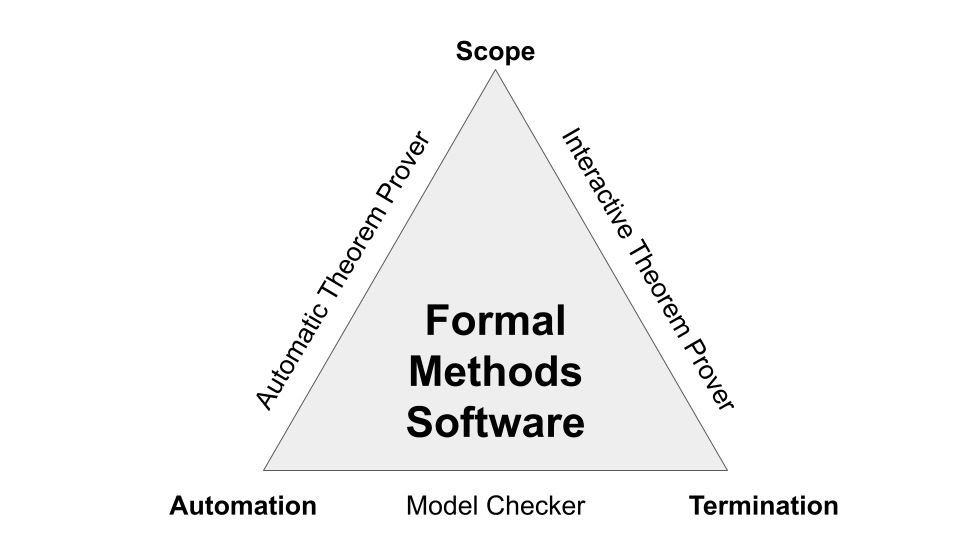
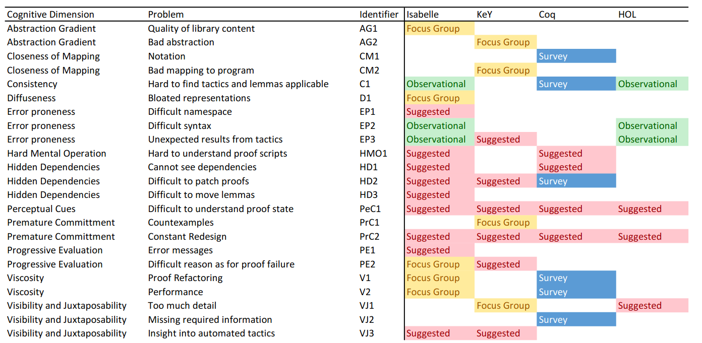

# Introduction
This is a thesis about **Interactive Theorem Provers**, what they are, how
they've been used in the past and whether you should explore using them in your
next project.

## Interactive Theorem Provers
An **Interactive Theorem Prover** (ITP) or **Proof Assistant** is a piece of software
that helps prove mathematical theorems, or equivalently, prove correctness
properties about software. Some of the more well known examples of provers 
include [Coq](https://coq.inria.fr/) and [Isabelle](https://isabelle.in.tum.de/).

In computer science, often correctness proofs of algorithms (For example,
Dijkstra's algorithm in an undergraduate context) are described and proved to
be correct on pen and paper. The use of an ITP in analogous to this type of
activity. 

The task of creating verified software is split into two steps: first specification
and then verification.

During specification, You specify what it is that you would like to prove, for
example, that Dijkstra's algorithm always finds the shortest path between two
nodes in a weighted graph, assuming positive weights. In this step, you would
create a specification for what is Dijkstra's algorithm, graphs, and shortest
paths. Then state that Dijkstra's algorithm finds the shortest path. This
step is far from trivial, and there exist dedicated specification languages for
this such as Z of VDL.

This specification leaves you with a **proof obligation**. A proof obligation is a onus
on the user to prove that the specification of the software is correct. Then,
during verification, it is then up to the user to provide
to the ITP the reasoning as to why this proposition is correct. This can be done
in several ways, sometimes through the use of automated software, or manipulating
with the proof by pointing and clicking, or writing down a **proof script** that
describes the steps made to prove the theorem. Often this involves breaking down one proof obligation into many other simpler
proof obligations that can be solved individually.

The ITP then checks whether the proof of the proposition is valid, assisting
you along the way in any errors that you make. The user and the ITP work
together until you have specified a proof of the statement you wish to claim.
Once that proof is made, you can be assured that the system works correctly.

Another way of approaching ITPs is through programming languages. Often a goal
in programming language design is to create languages where you cannot make a
certain class of errors. For instance, Rust is designed to allow systems level
programming that's protected from memory errors, and Elm is designed to create
web programs that do not have runtime errors. Languages often accomplish this
through Type Systems and Functional Programming. ITPs are languages that have
design features that allow you to go as far as proving the correctness of your
software. Almost all ITPs use Type Systems and Functional Programming to assist
in proving software.

ITPs can be used to both prove mathematical theorems and prove software is correct.
Because software can be expressed as a type of logic, the activities are identical.

Projects that use ITPs include the certified C compiler CompCert [@leroy_formal_2009], which is a C compiler that allows for a fully correct compilation of C. Or the fully verified microkernel SeL4 [@klein_sel4_2009].

## Formal Methods
ITPs are not the only way to specify and verify software. They belong to a class of techniques
named **Formal Methods**.

In essence, formal methods attempts to improve the process that users can prove
the correctness of their software systems. Use of formal methods can be done
without any tools at all, by simply proving properties by hand, such as the Dijkstra
example above.

However, computers and tools have aided people in providing large proofs for
software systems. The tools used in Formal Methods can be roughly divided into
three categories, Model Checkers, Automated Theorem Provers and Interactive
Theorem Provers. 

These three techniques are a trade off in three dimensions. You can pick two
but not all three.

{#fig:formal_methods}

**Automation**: Whether finding a proof is fully automated. That is, the user
does not need to specify a proof manually for the proposition, the system simply
attempts to find one automatically.

**Termination**: Whether the tool terminates in a reasonable amount of time 
when attempting to find a proof.

**Scope**: Whether the system can prove arbitrarily theorems.

**Model Checkers** are fully automated and terminate in reasonable time. However,
Model checkers can do this by restricting the scope of the systems that they can
prove. They allow for a specification for a system in a (usually finite) state
machine, and can prove properties about this state machine.

**Automated Theorem Provers** (ATPs) are fully automated and can prove arbitrary theorems,
however may not terminate in reasonable time. For larger systems or more complicated
theorems, they may run forever and never identify a proof or disproof for the
proposition.

**Interactive Theorem Provers** terminate in reasonable time and can prove
arbitrary theorems. However, they are not fully automated, and require the user's
input to guide the proof of the theorem.

The distinction between ATPs and ITPs is however not clear cut. ATPs can
often include minor user interaction in order to correct it's path and
find a proof. And ITPs often have automatic features and can even call
external ATPs to discharge proof obligations.

ITPs were chose for this investigation due to their usage in creating fully verified
software such as Coq and SeL4. Although large scale formalization fully certified
software efforts are possible through the usage of ATPs and Model Checkers, as 
far as the authors are aware, they have not been done. Furthermore, ATPs are
often used alongside ITPs to resolve proof obligations automatically, getting
the best of both worlds.

## Using an ITP
Proving properties with an ITP has the flavour of starting with a goal, and then
manipulating that goal into subgoals until you have proven the proposition.

To demonstrate the usage of an ITP, we will take a look at proving a theorem
in a pseudocode ITP syntax.

We start with a function:

$$
f(x) = 
  \begin{cases}
    f(x - 1) + x, & x > 0 \\
    0, & x = 0
  \end{cases}
$$

And I would like to prove that:

$$ f(x) = x(x - 1)/2 $$

To start with our proof, we first state to the ITP what we want to prove.

```
Prove: forall x, f(x) = x * (x - 1) / 2.
```

This is syntax that would look like what you would see in a textual ITP such as
Coq, Isabelle or HOL. However, there are many different styles of proving propositions.

After making this statement, you would likely be given a goal and your current
assumptions. For instance:

```
---
forall x, f(x) = x * (x - 1) / 2
```

All things above the `---` are assumptions, and the statement below it is the goal.

The next thing the user would likely do is attempt to prove it automatically.
Most ITPs have the ability to automatically prove simple propositions, often
by giving the `auto` command to the prover. If this succeeds, then the user is
done and the proposition is proven. Otherwise, the user must continue to explore
proof options.

Our first step is to introduce `x` as an assumption. We execute the `introduce` command.

```
introduce
```

Our state then becomes:

```
x : N
---
f(x) = x * (x - 1) / 2
```

Notice that the command modifies the state of the ITP. Only commands that are
valid at the time are allowed to be used, ensuring that all proof steps are valid
and construct a correct proof.

This particular proof is a very common beginners induction proof, so induction
would be a good start to solving this. The following command performs induction
on x.

```
induction x
```

```
---
f(0) = 0 * (0 - 1) / 2
```

Induction on natural numbers splits the goal up into two subgoals, the base case
and the inductive step. The prover is currently asking us to prove the base case.

This is a very easy task, as just evaluating the expression on both sides gives
0. To do this evaluation, we use the command `simplify`

```
simplify
```

```
---
0=0
```

Then finally, we can discharge the proof obligation by using the `reflexivity` command,
that is, everything is equal to itself.

```
reflexivity
```

```
f(x) = x * (x - 1) / 2
---
f(x + 1) = (x + 1) * x / 2
```

Now we are on the second stage of the proof, the inductive step. The ITP is now
asking us to prove that given the original statement is true, if we can prove
that it is true for x + 1.

The first step would be to evaluate `f(x + 1)` down by one layer. Which would be the
`unfold` command. This command replaces a function with it's definition.

```
unfold f
```

```
f(x) = x * (x - 1) / 2
---
f(x) + x = (x + 1) * x / 2
```

The top and the bottom statements are now identical, they just need re-arranging
for it to be possible. This might involve several commands to manipulate
the state of the equation. We will for the sake of brevity

```
expand (x + 1) * x
subtract both sides x
replace x with (2 * x / 2)
combine fraction
replace ( + x - 2 * x) with ( - x)
factorise (x * x - x)
```

The goal gets transformed as follows:

```
f(x) + x = (x * x + x) / 2
f(x) = (x * x + x) / 2 - x
f(x) = (x * x + x) / 2 - ( 2 * x / 2)
f(x) = (x * x + x - 2 * x) / 2
f(x) = (x * x - x) / 2
f(x) = x * (x - 1) / 2
```

Which leaves the final state being

```
f(x) = x * (x - 1) / 2
---
f(x) = x * (x - 1) / 2
```

This is exactly the same as our assumption, which means to finish of the proof,
we would call `assumption`.

```
assumption
QED
```

```
Proof accepted
```

It should be noted that the commands we wrote out are akin to deduction rules,
however, there is a problem with this approach, and the problem should become
clear once we write down all the commands that you put into the prover.

```
Prove: f(x) = x * (x - 1) / 2
introduce
induction x
simplify
reflexivity
unfold f
expand (x + 1) * x
subtract both sides x
replace x with (2 * x / 2)
combine fraction
replace ( + x - 2 * x) with ( - x)
factorise (x * x - x)
assumption
QED
```

These proof scripts are very difficult to understand statically. Our understanding
of the commands were aided due to our knowledge of the current state. However,
when looking at the script without the context of the state, they are often
very difficult to follow. Especially if the scripts are more complicated than
this one.

This thesis was inspired by the difficulty in reading static proof scripts. Some
provers have already moved to attempt to fix this problem. For instance, Isabelle's
Isar language offers a different way of proving propositions that embeds more
state, and helps the user understand the proof. It would be therefore valuable
to determine what usability issues have been reported, what has been done to fix
them, and whether solutions from some ITPs could be used to help other provers.

And finally, the secondary motivation of this thesis is to encourage further use
and development of ITPs. So it would be valuable to create a decision tool
that helps a user determine which ITP, if any, should be used for a particular
project.

Hence, the research questions for this thesis are:

RQ1 *What usability issues and solutions have been mentioned in literature regarding ITPs?* 

RQ2 *Do these usability issues and solutions still exist in the ITPs?*

RQ3 *What, if any, ITP should be used for a specific project?*

# Background

## Cognitive Dimensions of Notation
Cognitive Dimensions of Notation is a framework used to evaluate the
effectiveness of notations [@green_usability_1996], that is, ways of
writing down information. The notation was originally proposed by Green
as a way of discussing the design trade-offs of visual programming
languages, but has been applied elsewhere for a variety of notations.
These dimensions are not an evaluation framework for notations, as often
increasing one dimension will also change other dimensions, and
different tasks may require different dimensions. For instance, in
textual ITPs, dependencies are not shown between theorems, and doing so
would increase the Diffuseness of the notation, allowing less to be
shown and understood on a single screen. However, debugging why some
theorem might fail given a change in other theorems would aid from a
more diffuse representation showing the hidden dependencies.

Cognitive Dimensions focus mainly on the way that users understand and
work with the meaning of the program. Cognitive Dimensions make an
important distinction between difficulties of understanding and working
with the notation vs difficulties with the actual problem itself.
Because proving theorems is a very cognitively demanding task, that no
matter how perfect the notation will always have an inherit
difficulties. We can only try and improve the notations rather than
making the actual problems easier.

The notation has been adopted as a way of evaluating the usability of
ITPs in Kadoda PhD Thesis [@kadoda_desirable_1999]. The interpretation
of Cognitive Dimensions in regards to ITPs has been inspired by their
work, but has some notable differences.

The Cognitive Dimensions of Notation are:

#### Abstraction Gradient

Does the ITP offer ways of abstracting components? Abstraction here
refers to methods, classes and encapsulation. Green classifies notations
as either being abstraction-hating, abstraction-tolerant or
abstraction-hungry. An abstraction-hating ITP would be one that forces
you to work with low level constructs often. An abstraction-tolerant ITP
would be one that gives some methods for abstraction, but still
nevertheless requires constant low level interaction. An
abstraction-hungry ITP would offer many methods of abstraction, that
could even in the end obscure what is actually happening behind the
scenes.

#### Closeness of Mapping

Closeness of Mapping is how similar the notation is to the problem
domain. At some point, a representation of the problem has to be put
into notation suitable for the ITP. The easier this is to do the better
the closeness of mapping, or how close the proof state is represented vs
what the user would expect.

#### Consistency

Once you know the basics of an ITP, how much of the rest can be
inferred? A notation that is not consistent would require constant
lookup of features in the theorem prover. Consistency is particularly
important for learning ITPs. Consistency can become an issue when there
are a large amount of abstractions.

#### Error-Proneness

Is it easy to make careless mistakes? A common \"careless mistake\" in
theorem provers is trying to apply a tactic in a textual theorem prover
that is not valid for the current proof state.

#### Diffuseness

How much does it represent a proof relative to the complexity of the
proposition proven? This is an easier cognitive dimension to measure,
and represents the verbosity of the notation. ITPs with high diffuseness
often have lower abstractions and are easier to understand, but more
difficult to change.

#### Hard Mental Operations

Are there parts of the notation that require getting out a pencil and
paper to understand what it means? The domain of ITPs by it's very
nature requires Hard Mental Operations, so it's important to separate
the inherit difficulty vs difficulty created by the notation. Hard
Mental Operations may arise out of particularly complicated tactics,
especially since tactics can be composed together. An ITP with a
consistent set of tactics would reduce Hard Mental Operations.

#### Hidden Dependencies

Are there dependencies in the notation that are not presented? In ITPs
and programming languages, it's usually possible to find what a
function/lemma references, but is difficult to find what
lemmas/functions reference the one we are working in. Furthermore,
automation often uses lemmas in the context without indicating at all
that it is using them. This makes the issue of hidden dependencies even
more difficult. An ITP with low hidden dependencies makes these
dependencies between parts of the program explicit

#### Perceptual cues

Does the notation force the user to make decisions before they have the
information they need to make it? Especially for novice users, ITPs need
to allow the user to explore different paths for proving a statement.
This often represents a premature commitment as the user has to commit
to a strategy before evaluating whether that strategy would work. ITPs
that offer undo features and allow postponing making decisions require
less premature commitment.

#### Premature commitment

Does the notation force the user to make decisions before they have the
information they need to make it? Especially for novice users, ITPs need
to allow the user to explore different paths for proving a statement.
This often represents a premature commitment as the user has to commit
to a strategy before evaluating whether that strategy would work. ITPs
that offer undo features and allow postponing making decisions require
less premature commitment.

#### Progressive Evaluation

Does the system give adequate feedback? Error messages, display of
current proof state and ability to work with incomplete proofs are all
features of progressive evaluation. Getting feedback from the system is
absolutely essential for learning the ITPs.

#### Role Expressiveness

Is it easy to identify what the purpose of a component is? Lack of role
expressiveness, particularly within the proofs of textual ITPs, was one
of the main motivations of this study. It is often very difficult on
retrospect to identify how the components of a proof relate to each
other. An ITP with high Role Expressiveness would make it clear how a
lemma or component of a proof contributes to the proof.

#### Secondary Notation

Are there avenues for comments, colours and representation of the code
that helps with comprehension? A Secondary Notation is a way of
representing understanding by not changing the actual meaning of the
notation. ITPs that offer comments, colours and whitespace grouping help
with representing secondary notation.

#### Viscosity

Is it easy to make a change in the system? ITPs with low abstraction
make it difficult to make changes. Sometimes a small difference to what
you are wanting to prove requires a disproportionate change of the
proof. ITPs with high viscosity make it difficult to change.

#### Visibility and Juxtaposability

How easy is to get a particular piece of desired information? How easy
is it to compare part of your proof with proofs elsewhere? Sometimes
critical information is difficult to obtain when creating or
understanding a proof state. A common example is being able to inspect
intermediate proof steps. When a proof relies heavily on automation, it
is sometimes difficult to understand how the automated tactic managed to
get in a particular proof state. Having this information helps
understand the proof and how to move forward. ITPs with low visibility
make it difficult to find such information.

Juxtaposability is showing two parts of the system side by side. This is
important as often a proof might only be a refinement of a previous
proof, and might need to be understood in context.

# Methodology
To recall our research questions:

RQ1 *What usability issues and solutions have been mentioned in literature regarding ITPs?* 

RQ2 *Do these usability issues and solutions still exist in the ITPs?*

RQ3 *What, if any, ITP should be used for a specific project?*

The natural method for answering RQ1 is to perform a systematic literature review.
This literature review intends to identify and categorize usability issues related
to different theorem provers.

Answering RQ2 requires going through the theorem provers and identifying the
issues.  However, ITPs are continually in development, and any issue that
arises could be solved at a future date. As of such, we created a **living
review** to answer this question.

A living review is a literature review of a field that updates periodically to reflect the
current state of the research. These reviews are often published
electronically, such as to a website. The goal of a living review is to ensure
that the review never goes stale, and can be used as a reference years to come.

This living review is the primary output of this thesis, and although it has the
word "review" in it, should not be mistaken for just another literature review.

It differentiates itself from a normal review by updating automatically over time,
being an interactive software product, and existing as a decision tool for users.

The creation of this living review will answer RQ3 and RQ2, and provide
descriptions of the current state of the field for ITPs.

## Systematic Literature Review Methodology {#sec:review_methodology}
A preliminary literature review was done in order to survey what
usability problems occurred about theorem provers. This preliminary
review came from a search for "usability interactive theorem provers\"
on the ACM digital library and Google Scholar. The review found several
papers on the topic. We then attempted to construct a query that would
match these papers and also other papers in the field.

Papers were searched for having the title matching the following query:
`("Interactive" OR "Deductive") AND ("prover" OR "provers" OR "proving" OR "verifier") AND ("usability" OR "user" OR "users")`

The justification for using quotes around prover, provers and proving is
that some search engines will return papers with the text \"prove\" when
looking for \"prover\". \"prove\" therefore comes up with many more
records that are unrelated to our topic. \"Usability\" is also quoted to
prevent searching for \"use\", which clearly would bring in papers that
are unrelated.

We searched the following databases using this query string:

-   Scopus
-   DBLP
-   Springer Link
-   Science Direct
-   ACM
-   IEEE Xplore

From the papers discovered in this way, we went through the abstracts
and discerned whether the paper was relevant to the research question.

Our inclusion criteria for the papers included in the systematic
literature review was the following:

-   A peer review published paper AND
-   Notes particular usability issues with theorem provers OR
-   Offers direct recommendations to the improvement of the usability of
    interactive theorem provers

We particularly excluded papers written in languages other than English,
workshops, tutorials, extended abstracts, unpublished and non peer
reviewed papers.

From the papers that were deemed relevant to the research question, we
found papers that cited the papers discovered. That is, we applied
forward snowballing. Semantic scholar was used to perform the forward
snowballing.

We then tried to discover whether these papers were relevant to the
research question, and repeated the process of forward snowballing until
there were no more papers discovered.

We then read the paper to discover:

-   A problem and/or solution to usability of interactive theorem
    provers
-   Which theorem prover the issue is relevant to
-   Evidence behind issues and proposed solutions

The issues were then categorized by Green's cognitive dimensions of
notations [@green_usability_1996].

## Living Review Methodology
The living review has the end goal of determining whether usability issues still
exist, and then further offering a tool to help decision about ITPs (RQ3).

To do this, the living review is scoped as follows:

- Comparing general properties about ITPs (RQ3)
- Comparing past projects that have been completed by ITPs (RQ3)
- Comparing progress on usability issues about ITPs (RQ2)

### General features of about ITPs
To compare between different ITPs, general features about them need to be collected.

We decided to use a 2019 Systematic Literature Reviews on Theorem Provers as our starting dataset [@nawaz_survey_2019]. 
This review went through 27 theorem provers and described the features that each
prover had. This was converted into a dataset and used to compare general features.

This dataset contained several properties about ITPs, and properties to compare between them.

The full set of properties are:

- What the ITP is based on
- The logic of the ITP
- The Truth value of the ITP
- Whether it supports Set theory
- Whether it has a library
- What its calculus is
- What's its architecture
- The programming language it's based on
- The User interface
- The Platforms its supported on
- Whether it's scalable
- Multithreaded support
- Whether it has an IDE
- When it was first released.
- Its latest release

A lot of these features (such as the logic, truth value etc) require explanations
as to what they refer to. These explanations will be included within the tool.
This allows people unfamiliar to the field to learn what the components of ITPs
are and why they are important.

Some newer ITPs were not included in the dataset, such as Lean, F* and Idris.
These were added manually to the dataset.

The systematic literature review we source our data from however, is already
out of date for the latest release of its provers. As of such, we have a python
script that automatically retrieves whether any newer versions of a prover have
been released by checking GitHub Tags. It gets the latest tag to be published
and adds that as the latest release on the living review, ensuring that the
review doesn't go out of date by having newer releases.

### Comparing projects between ITPs
One important thing to consider when making decisions about ITPs to choose is
what past projects have been completed within the ITP. As of such, we contain
a review of different notable projects within the ITP.

Each project will describe:

- The project's name
- The project's scope
- When it was completed
- The ITP used

This should help users understand what work has been done with an ITP before
using it. This should help a user decide whether this ITP is suitable for the
task at hand.

### Comparing progress on usability issues for ITPs
Finally, depending on the results of the literature review, progress on different
usability issues will be reported in this living review.

How these will be included into the living review will be detailed later, once
those features have been identified.

# Literature Review
The amount of papers found in each section of the review are shown in
[@tbl:litresults]. This totals to 45 papers found on the
topic. However, 1 paper had to be remove due to not being able to access
it, making 44.

There was a surprisingly small amount of papers caught by query in
comparison to snowballing. This is because many papers that discuss
usability issues about ITPs do not tackle the problem directly (28/38 of
the papers), but rather showcase a feature that has been coded into an
ITP interface. These features do indeed solve a usability problem
implicitly, and represent the bulk of the work on improving interfaces
for ITPs. However, comparatively little research has been done
identifying the issues with ITP interfaces and empirically comparing
these user interface modifications for merit (10/38 of the papers).

  Round        Found   Relevant
  ------------ ------- ----------
  Query        45      14
  Snowball 1   121     14
  Snowball 2   191     5
  Snowball 3   99      2
  Snowball 4   44      1
  Snowball 5   4       0

  : Literature review papers {#tbl:litresults}


When going through papers, it was interesting to find a large amount of
papers proposing user interface models, but not actually identifying the
problems that they solve, nor evaluating their effectiveness. In fact,
out of the 28 papers that showcased user interface improvements, only 2
papers evaluated the their interface improvement to without the
improvement [@hentschel_empirical_2016; @berman_development_2014]. That
there is not enough empirical studies verifying usability issues has
been cited as an issue that needs to addressed in the
past [@hahnle_deductive_2019].

The following sections outline usability issues and solutions to those
issues. Tables are included outlining the usability issues mentioned. If
the same problem is mentioned in two papers, it is given two rows.

The theorem prover column refers to the theorem prover the usability
issue was found in. If the problem is a general comment "General\" is
written. "Textual\" means a theorem prover that uses proof script to
solve theorems, such as Isabelle/HOL, Coq, Agda. "Direct Manipulation\"
means a theorem prover that uses direct manipulation to solve theorems,
such as KeY.

The discovered column indicates the evidence that that problem exists.
\"Suggested\" simply means that problem or solution was simply inferred
or has not actually been evaluated as effective. Other values indicate
the type of study that the paper used to observe or evaluate this
problem or solution.

## Theorem Provers

First of all, a brief overview of the theorem provers is in order.

#### KeY

KeY is a Direct Manipulation theorem prover, meaning that unlike Textual
theorem provers, does not prove theorems by writing proof scripts, but
instead works by modifying a proof object directly until all proof
obligations have been solved. KeY works by annotating Java programs with
preconditions and postconditions. These conditions are then fed into KeY
as proof obligations. KeY can act as a fully automatic prover, but also
allows the user to attempt to find a proof if the prover fails. KeY has
also formed the basis of KeYmaera and KeYmaera X, which are for proving
properties of hybrid systems.

#### HOL

HOL is actually a family of theorem provers. Notably HOL4, ProofPower,
HOL Light and HOL Zero. HOL is one of the oldest provers in this list,
and HOL Light is known to be used as a lightweight prover, with a very
easily checkable kernel. HOL provers are textual, and have a simple type
system and use tactics to prove propositions.

#### Isabelle

Isabelle (also known as Isabelle/HOL, but for this paper will remain as
Isabelle to prevent confusion) is one of the most popular theorem
provers. The prover has been used for the verification of the SeL4
prover, and exists as the state-of-the-art of ITPs. Isabelle like HOL
has a simple type system and is based of the Logic for Computable
Functions.

#### Coq

Coq is another popular ITP that also supports a dependent type system.
It's based on the Calculus of (Co)Inductive Constructions, which was
designed specifically for Coq. Coq has been used to prove the four
colour theorem, and create the CompCert certified C compiler.

#### Matita

Matita is a theorem prover based on Coq's Calculus of (Co)Inductive
Constructions, and was designed to address many of the pain points in
working with Coq. Matita is a much simpler prover that aims to present
the theorem prover as editing a mathematical library. As of such,
Matita's solutions to problems are often pain points in Coq
(mathematical notation, Tinycals etc).

There are a few other provers also in this review, such as iCon, CardiZ
and Dafny. These ITPs are often either coded as proofs of concepts (such
as iCon), or are no longer maintained (in the case of CardiZ or Dafny).
The problems raised by them however, are often relevant for current day
ITPs.

This is by no means a complete list of modern ITPs. Such compilations
have been done [@nawaz_survey_2019]. These are only the ITPs discussed
in the papers found in the review. There are notable ITPs that are
missing from this list that caught us by surprise, including Agda, Lean
and Mizar.

## Interaction Paradigms

Before moving into the actual problems and solutions found in ITPs, it's
worth giving a short history of the interaction paradigms of ITPs, and
possible developments.

Direct Manipulation ITPs such as KeY work by editing proof objects until
the obligations have been resolved. These provers often have issues with
tedious interactions, and work has even been done add textual elements
to KeY [@beckert_interaction_2017]. The development of interfaces to
Direct Manipulation provers often differs from textual ones.

Textual ITPs such as HOL, Isabelle, Coq and Matita work by writing a
proof script that attempts to prove a proposition. Interacting with
textual ITPs often involves a very simple read-evaluate-print-loop
(REPL) for their interfaces. One very stark example of this is
HOL-Light, which you interact with by opening up the OCaml REPL (a
general purpose ML based functional programming language) and loading
the HOL library. All OCaml is available to you alongside the HOL
library. Although this is rather primitive, modern ITP interfaces such
as Isabelle/jEdit and CoqIDE usually offer only a small layer of
abstraction over a REPL for their own languages.

These interfaces have two main windows, the first has code and the
second has proof state. The code can be evaluated up to a certain point,
and the output from the REPL in terms of proof state are printed in the
second window. The only major difference between this and a standard
REPL is that you can rewind to evaluate up to a previous line. This
simple style of interface has consequences for usability. In particular,
if any error is found either in proof or in syntax, execution stops
until that error is resolved. Further, for larger projects, it can take
a very long time for systems to recompile. It also means that you can
only identify things that have already been identified (it has to be a
single pass). This is particularly an issue when automated tactics
attempt to use lemmas above them to find solutions to theorems (such as
Isabelle). This means that simply changing the order of lemmas in an
Isabelle document, even if they never reference lemmas that are below
them, could cause a lemma that was proven before to become unproven.

Developments in IDEs to allow asynchronous interfaces, reloading only
parts needed and loading proofs out of order have been introduces to fix
this problem. They are called \"Prover IDEs\", with two examples being
Isabelle/PIDE [@wenzel_asynchronous_2014] and
Coq/PIDE [@barras_asynchronous_2015]. These hopefully will resolve some
of the issues cited above.

Although we have examples of large projects undertaken with ITPs,
optimal interaction paradigms are still up for debate, and several novel
interaction paradigms have surfaced. Including proving theorems and
writing tactics with
diagrams [@grov_tinker_2018; @lin_understanding_2016; @shams_accessible_2018],
or providing agent based interfaces [@hunter_agent-based_2005].

We now move into the usability problems and solutions found in ITPs.

## Abstraction Gradient

  Theorem prover   Problems                           Discovered     citation
  ---------------- ---------------------------------- -------------- ---------------------------
  KeY              Interaction with low level logic   Focus Groups   [@beckert_usability_2015]
  Isabelle         Missing Library                    Focus Groups   [@beckert_usability_2015]

  : Abstraction Gradient Problems {#tbl:abstraction_gradient}

The abstraction gradient dimension concerns itself with the highest and
lowest levels of abstraction that are presented. Are they at the
appropriate level of abstraction?

Issues in this dimension were uncommon. KeY was found to require
interacting on low level logic formulas consistently. Similar issues
with tedious interactions with KeY are mentioned in the viscosity's
section. No solutions were found or suggested to this problem, and it
has not been empirically tested.

Focus Groups found that Isabelle's library lacks the appropriate
mathematical foundations. Interestingly, this is the only issue of this
class and is not mentioned elsewhere, often library issues are more
about managing and searching large libraries, which Matita attempts to
handle, and correct documentation of libraries. This has not been tested
empirically. Other than the implicit solution of providing better
library support for theorem provers, no solution has been provided for
this problem.

## Closeness of Mapping

  Theorem prover   Problems                                          Discovered     citation
  ---------------- ------------------------------------------------- -------------- ---------------------------------------------
  KeY              Unintuitive mapping between formula and program   Focus Groups   [@beckert_usability_2015]
  CardiZ           Cannot sketch out proofs                          Questionnaire   [@kadoda_cognitive_2000]
  Coq              Cannot use mathematical notation                  Survey         [@berman_development_2014]
  Coq              Cannot use mathematical notation                  Suggested      [@asperti_user_2007; @zacchiroli_user_2007]

  : Closeness of Mapping Problems {#tbl:closeness_of_mapping}

The dimension of closeness of mapping is whether the interface maps well
to the problem world. For interactive theorem provers, it has to do with
how well the proof state is understood in comparison to the actual
problem.

Focus groups found that because KeY attempts to prove properties through
annotations and java source code, it can sometimes be difficult to see
how this proof state maps to the program [@beckert_usability_2015]. This
issue is not mentioned in any other source and not tested empirically.
No solutions have been suggested for this.

CardiZ, an ITP that can be used to prove properties of Z specifications,
found that you could not sketch out proofs before an attempt. This is
the only paper on CardiZ, as CardiZ is not a popular prover. No
solutions have been suggested for this.

A common issue that came up with Coq was the inability to use
mathematical notation. Notation issues are problematic in ITPs. One
one hand, theorem provers such as Isabelle and Agda allow using
mathematical notation in their theorems. This helps the user understand
the theorem in a terse syntax. On the other hand, mathematical notation
can often be ambiguous and difficult to type. Isabelle allows using
LaTeX style commands such as rightarrow to render math notation, whereas Agda allows Unicode in
source files. In order to avoid ambiguity, Coq has no support for math
notation, and in response to this, Matita has LaTeX style mathematical
notation [@asperti_user_2007; @zacchiroli_user_2007]. This issue came up
in three different sources.

## Consistency

  Theorem prover   Problems                                           Discovered      citation
  ---------------- -------------------------------------------------- --------------- ------------------------------------------------------
  Isabelle         Difficult to know what tactics and lemmas to use   Focus Groups    [@beckert_usability_2015; @beckert_interaction_2017]
  HOL              Difficult to know what tactic to apply next        Suggested       [@aitken_interactive_1998]
  Isabelle         Hard to remember prover specific details           Suggested       [@nagashima_pamper_2018]
  KeY              Difficult to know what tactic to apply next        Suggested       [@mitsch_keymaera_2017]
  Isabelle,HOL     Difficult to remember names of theorems            Observational   [@aitken_analysis_2000]
  Coq              Difficult to find relevant lemmas                  Survey          [@berman_development_2014]
  Coq              Difficult to find arguments for tactics            Observational   [@ringer_replica_2020]
  Coq              Bad Library, inconsistent naming                   Survey          [@berman_development_2014]

  : Consistency Problems {#tbl:consistency}

Consistency is the cognitive dimension of whether, once learning part of
the notation, you are able to infer the rest of the notation.

In textual theorem provers, it is often difficult to remember the name
of the next tactic, theorems or lemmas should be applied in any
situation. This has been bought up in focus
groups [@beckert_usability_2015], observational
studies [@aitken_analysis_2000], surveys [@berman_development_2014] and
suggested as a problem from various other sources.

Solutions to this problem often include choosing applicable tactics by
menu [@aitken_analysis_2000; @aitken_interactive_1998] Which has been
implemented in Coq through Proof Previews [@berman_development_2014] and
in KeYmaera X [@mitsch_keymaera_2017]. Machine learning for choosing
appropriate recommendations has been suggested for this
problem [@ringer_replica_2020], and has also been implemented through
the PaMpeR tool in Isabelle [@nagashima_pamper_2018]. A second way of
tackling this problem is to improve library searching, which was
suggested [@aitken_analysis_2000] and is a focus in
Matita [@tassi_interactive_2008]. Improving these tools is a promising
area for improving the usability of ITPs

## Diffuseness / terseness

  Theorem prover   Problems                                  Discovered      citation
  ---------------- ----------------------------------------- --------------- ---------------------------
  Isabelle         Bloated Formulas                          Focus Groups    [@beckert_usability_2015]
  Isabelle         Large proofs correspond to large effort   Observational   [@bourke_challenges_2012]

  : Diffuseness / Terseness Problems {#tbl:diffuseness}

Diffuseness is the cognitive dimension of the tersity/verbosity of the
syntax. Bloated formulas were mentioned in Isabelle in Focus Groups, and
projects with more lines of code were strongly correlated with more
effort. No solutions have been suggested to reducing the size of code
bases or formulas.

## Error Proneness

  Theorem prover   Problems                                           Discovered      citation
  ---------------- -------------------------------------------------- --------------- ---------------------------
  Isabelle,HOL     Easy to get errors in Object Level Constructions   Observational   [@aitken_analysis_2000]
  Isabelle,HOL     Incorrect predictions made about tactics           Observational   [@aitken_analysis_2000]
  Isabelle         Difficult to manage namespace                      Suggested       [@bourke_challenges_2012]

  : Error Proneness Problems {#tbl:error_proneness}

Error proneness is the cognitive dimension of whether a system allows
its users to make errors.

Observational studies have found that in Isabelle and HOL it is easy to
make errors in syntax. Considering the frequency of syntax errors, this
issue came up surprisingly little other sources. This could be because
syntax errors are relatively easy to fix and also decrease with usage.
It's been suggested that this problem could be solved my improving
feedback in Object Level syntax input [@aitken_analysis_2000]. A more
interesting solution has been implemented for Coq is a structure editor
based off keyboard cards [@berman_development_2014]. This uses rolling
chords (like *vi*) keyboard interfaces to interact with the theorem
prover. This means that it is only possible to enter syntactically valid
statements. This current solution only works on a subset of Coq's
syntax. It was found to be slightly quicker than using dropdown menus.

Sometimes when applying a tactic, an unexpected result would occur,
causing the user to back up and try to understand the current state.
This issue could be solved by Proof Previews [@berman_development_2014],
which allow you to see a proof state when selecting tactics from a menu
without actually applying the tactic. That way the user can cheaply
explore tactics to continue in the proof.

Finally, for large verification projects such as SeL4, there is an issue
with managing the namespaces of large amounts of theorems and lemmas. No
verification of this problem nor solution has been suggested.

## Hard mental operations

  Theorem prover   Problems                                      Discovered   citation
  ---------------- --------------------------------------------- ------------ ----------------------------------------------
  Coq              Hard to understand proof scripts statically   Suggested    [@zacchiroli_user_2007]
  General          Difficult to understand tacticals             Suggested    [@grov_tinker_2018; @lin_understanding_2016]
  General          Proof scripts can become complicated          Suggested    [@aspinall_towards_2016]

  : Hard Mental Operations Problems {#tbl:hard_mental_operations}

The dimension of Hard Mental operations refer to the difficulty in
understanding and using the interface on a syntax level. This type of
issue is common with ITPs, as the actual domain is complicated, so this
is reflected with difficult syntax.

Proofs are hard enough to understand while viewing the dynamic nature of
the proof, investigating proof state bit by bit. They are often near
impossible to understand statically [@zacchiroli_user_2007]. This issue
has not been investigated empirically, but solutions often involve
changing the syntax around proofs. One notable example of this is Isar
for Isabelle [@wenzel_structured_2006], which attempts to mirror how a
pen and paper proof is structured.

It is often difficult to understand tacticals, and the problem is made
even worse when it is not possible to view the state of a tactical mid
way through interaction. This problem has been suggested in several
sources [@grov_tinker_2018; @lin_understanding_2016; @zacchiroli_user_2007]
but never empirically investigated. Solutions to this include
representing tacticals as
graphs [@grov_tinker_2018; @lin_understanding_2016]. This solution has
not been tested with users.

Proof scripts can also get very complicated for larger propositions.
Keeping track of this complexity has been suggested with proof metrics,
which are similar to classic code complexity
metrics [@aspinall_towards_2016].

## Hidden dependencies

  Theorem prover   Problems                                               Discovered   citation
  ---------------- ------------------------------------------------------ ------------ ---------------------------------
  Isabelle         Hard to see dependencies between proofs                Suggested    [@spichkova_human-centred_2017]
  KeY              Difficult to patch proofs that have slightly changed   Suggested    [@beckert_evaluating_2012]
  Isabelle         Hidden automation dependencies                         Suggested    [@bourke_challenges_2012]
  Isabelle         Difficult to patch proofs when dependencies change     Suggested    [@bourke_challenges_2012]
  Isabelle         Hard to see dependencies between proofs                Suggested    [@aspinall_towards_2016]

  : Hidden Dependencies Problems {#tbl:hidden_dependencies}

Hidden dependencies represent dependencies between components that are
not shown explicitly. Hidden dependencies are everywhere in theorem
provers. Like functions in many programming languages, lemmas can
reference the lemmas that they use, but it is difficult to find where a
particular lemma has been used. Automation makes this problem even
worse, where in Isabelle, an automatic tactic will try lemmas that are
above it in the theory. This makes moving lemmas around a theory
document difficult. Moving a lemma around a document, even if all the
other lemmas it is references are above it, may cause it to fail due to
it using a lemma by automation. Monitoring dependencies has been
suggested as part of formal proof metrics. It's been suggested and
implemented within CoqPIE to show these dependencies within the
IDE [@roe_coqpie_2016]. Tools have also been built to analyse
dependencies between Isabelle proofs [@spichkova_human-centred_2017].
For automated tactics, Isabelle's sledgehammer offers a unique solution
to showing dependencies. The automatic tactic, after execution, simply
prints a set of manual tactics that were used to prove the theorem into
the document. That way, all the lemmas that were used in the automated
tactic are made explicit [@bourke_challenges_2012]. None of these
solutions have been empirically tested for validity.

Furthermore, often changing a definition or proof slightly requires
changing the proof in order to match the new definitions. This is a
tedious process.

None of these issues have been tested empirically.

## Perceptual cues

  Theorem prover   Problems                              Discovered   citation
  ---------------- ------------------------------------- ------------ -------------------------------
  HOL              Difficult to understand proof state   Suggested    [@kadoda_cognitive_2000]
  KeY              Difficult to understand proof state   Suggested    [@hentschel_integrating_2016]
  General          Difficult to understand proof state   Suggested    [@eastaughffe_support_1998]

  : Perceptual Cues Problems {#tbl:perceptual_cues}

Perceptual cues is how easy it is to understand what is being
represented. Understanding proof state is an enormous part of theorem
proving. The normal solutions to understanding proof state are to offer
more ways of viewing it, and ensuring easy access to these views. As of
such, solutions are found in the visibility section.

## Premature Commitment

  Theorem prover   Problems                                                  Discovered   citation
  ---------------- --------------------------------------------------------- ------------ ----------------------------
  HOL              Need to redesign model if proof attempt fails             Suggested    [@beckert_usability_2015]
  Coq              Have to apply tactics before understanding what they do   Suggested    [@berman_development_2014]

  : Premature Commitment Problems {#tbl:premature_commitment

When an attempt to prove a theorem fails, either one of two things has
happened. First, the proof you are attempting to perform is incorrect,
or the model itself is in error. The model is often in error, and as of
such there is a premature commitment to a model before having a full
understanding. Counterexample generators such as Quick Check and
nitpick [@beckert_usability_2015; @beckert_interaction_2017] for
Isabelle help prevent the user from trying to prove improvable lemmas by
providing the user with a counterexamples to show why their lemmas can't
be true.

Furthermore, tactics often need to be applied to discover what they do.
Typing out this tactic is part of the exploration, and represents
another premature commitment. A cheaper way to explore tactic
applications were trialed with Proof previews in
Coq [@berman_development_2014]. These proof previews allowed the
selection of the next tactic by menu, and hovering over a tactic
previewed it's application in a separate window. This was found to be
helpful with users.

## Progressive Evaluation

  Theorem prover   Problems                                                    Discovered   citation
  ---------------- ----------------------------------------------------------- ------------ ---------------------------------------------------------------------------------
  General          Hard to understand why proof state fails                    Suggested    [@hentschel_interactive_2016]
  KeY              Hard to understand why proof state fails                    Suggested    [@beckert_interaction_2017; @beckert_interactive_2015; @beckert_usability_2015]
  Dafny            Hard to understand why proof state fails                    Suggested    [@grebing_seamless_2020]
  KeY              Hard to understand why proof state fails                    Suggested    [@lin_understanding_2016]
  General          Hard to understand automated tactics                        Suggested    [@mitsch_keymaera_2017]
  e General        Not enough feedback hinders learning                        Suggested    [@mitsch_keymaera_2017]
  Coq              Lack of background automation                               Survey       [@berman_development_2014]
  General          Lack of background automation                               Suggested    [@hunter_agent-based_2005]
  KeY              Bad feedback hinders learning                               Survey       [@beckert_evaluating_2012]
  Coq              Don't know whether an automated tactic would prove a goal   Survey       [@berman_development_2014]
  Isabelle         Non reactive interfaces                                     Suggested    [@beckert_usability_2015]
  Isabelle         Hard to understand errors from bad inferences of types      Suggested    [@beckert_usability_2015]
  Isabelle         Performance of automatic strategy                           Suggested    [@beckert_usability_2015]
  Isabelle,KeY     Difficult to understand automated strategy                  Suggested    [@beckert_usability_2015]

  : Progressive Evaluation Problems {#tbl:progressive_evaluation}

Progressive evaluation is the dimension of getting appropriate feedback
from the system.

Not understanding why proof attempts fails in a widely cited example of
this. This becomes especially true when automation is added to the mix.
Insight to the operation of automated tactics is missing in many ITPs.
This has been suggested to be one of the largest issues with the
usability of ITPs in Focus Groups [@beckert_usability_2015]. Although
there is little empirical evidence of this issue, the fact that it is so
widely cited indicates importance. Solutions to this issue often resolve
around providing better visibility, and are covered there.

Other issues include that systems with low feedback make it difficult to
teach using ITPs, and that ITPs do not effectively use background
processing to provide the user with feedback. One way of improving
feedback is using a cache of proof
state [@berman_development_2014; @bourke_challenges_2012]. Another more
novel way is to provide an agent based interaction
model [@hunter_agent-based_2005], where the user interfaces have a
\"Personal assistant\", who then negotiates with proof agents to help
solve a particular proof. This makes best use of background processing
while the user is trying to solve a problem. Neither of these have been
tested with users.

Finally, it was mentioned in a survey of Coq users that it would be nice
to know in advance whether an automated tactic could prove a goal. This
would prevent further unnecessary work.

## Secondary Notation

Secondary notation is the realm of comments, documentation, and even use
of visual placement to convey meaning. Problems due to lack of secondary
notation are usually simply because of missing features, and are
therefore more naturally discussed as solutions.

  Theorem prover   Intervention                               Discovered   citation
  ---------------- ------------------------------------------ ------------ ----------------------------
  HOL              Allow notes in tree contexts               Suggested    [@aitken_interactive_1998]
  Isabelle,HOL     Allow adding notes to proof context        Suggested    [@beckert_evaluating_2012]
  Isabelle         Add document orientated features           Suggested    [@wenzel_isabelle_2011]
  Isabelle         Gravity for automated lemma placement      Suggested    [@bourke_challenges_2012]
  Isabelle         Deprecation tags                           Suggested    [@bourke_challenges_2012]
  Coq              Doc comments                               Survey       [@berman_development_2014]
  HOL/CardiZ       Colour and low secondary notation          Survey       [@kadoda_cognitive_2000]
  Coq              Lack of good tutorials and documentation   Survey       [@berman_development_2014]
  KeY              Poor documentation                         Suggested    [@beckert_evaluating_2012]
  Isabelle         Better libraries and documentation         Suggested    [@berman_development_2014]

  : Secondary Notation Solutions {#tbl:secondary_notation}

One improvement on secondary notations is the ability to note and label
parts of proof context. Usually, proof context is boxed off and cannot
be documented other than basic comments. Interestingly, although this
feature is cited multiple times. It remains, to the best of my
knowledge, unimplemented, and as with the rest of the solutions in this
category, untested.

Document oriented proof organization tries to make each theory readable
both to a human and to a computer, and involves allowing linking to
external theories, websites, diagrams and other features all in the
prover editor. This is commonly done with web interfaces controlled by
ITP code. This method has not been investigated as being beneficial, but
Matita itself was built to support this style of interaction.

Features such as deprecation tags, doc comments and automatic naming of
lemmas frequently showed up. These indicate that it is important for the
user to break out and write hints to help themselves and others navigate
their code. These have been implemented in some provers, but again, have
not been tested.

Finally, a very common issue with ITPs is the lack of tutorials and
documentation, particularly around library functionality. This is
remarkably important, regardless of what the prover is.

## Viscosity

  Theorem prover        Problems                                            Discovered     citation
  --------------------- --------------------------------------------------- -------------- ---------------------------------------------------------
  Isabelle              Messy Downwards compatibility                       Focus Groups   [@beckert_usability_2015]
  Isabelle              No support for proof refactoring                    Focus Groups   [@beckert_usability_2015]
  Direct Manipulation   Tedious Interactions                                Suggested      [@grebing_usability_2020; @beckert_usability_2015]
  General               Hard to make effective use of large library         Suggested      [@asperti_considerations_2010; @tassi_interactive_2008]
  Isabelle              Tacticals difficult to write                        Suggested      [@becker_lassie_2021]
  Coq                   Have to update proofs once definition changes       Suggested      [@ringer_replica_2020]
  Coq                   Proof renaming and refactoring is tedious           Suggested      [@ringer_replica_2020]
  Coq                   Large proof scripts require too long to recompile   Suggested      [@barras_asynchronous_2015]
  Isabelle              Large proof scripts require too long to recompile   Suggested      [@wenzel_asynchronous_2014]
  Coq                   Difficult to select terms                           Survey         [@berman_development_2014]
  Coq                   Unnecessary re-running of proofs                    Survey         [@berman_development_2014]
  Coq                   Slow for large proofs                               Suggested      [@roe_coqpie_2016]
  Coq                   Change in lemma requires change in proof            Suggested      [@roe_coqpie_2016]
  KeY                   Bad change management                               Suggested      [@beckert_evaluating_2012]
  KeY                   Bad Automated proof performance                     Suggested      [@beckert_evaluating_2012]
  KeY                   Hard to decompose proof                             Suggested      [@beckert_interactive_2015]

  : Viscosity Problems {#tbl:viscosity}

Viscosity is the cognitive dimension of the ease of changing the state
of the programs.

One source of viscosity is simply performance. As automatic strategies
get more complicated, their performance becomes important for them to be
useful to the user. This has been suggested by focus groups and in
surveys. This becomes a particularly difficult problem especially for
larger systems. Attempts to improve performance have been done by
asynchronously loading only required parts of the proof in
Coq [@barras_asynchronous_2015] and
Isabelle [@wenzel_asynchronous_2014]. Improvements to performance of
automatic strategies will always be an
improvement [@bourke_challenges_2012], including making better use of
the library [@tassi_interactive_2008; @asperti_considerations_2010].

A second source is the need to make trivial interactions when making
small changes. For instance, the renaming of a lemma might mean you need
to go through several files to find where to change the identifier.
Messy downwards compatibility, changing definitions, and lack of
refactoring are all examples of this. These are usually addressed by
refactoring tools that have been suggested as
necessary [@ringer_replica_2020; @bourke_challenges_2012] and
implemented in some IDEs such as CoqPIE [@roe_coqpie_2016]. These
solutions have not been tested with users.

The third is simply interactions that are tedious and error prone. This
is more common in direct manipulation theorem provers such as KeY. No
solutions have been suggested for this problem.

Finally, the fourth source of viscosity is clunky syntax, such as the
need to explain selections to the theorem prover. Selections are a
common issue where you need to describe the part of the goal that you
want to rewrite. This part might be complicated, but has to be
represented textually. This has served as a challenge for ITP designers.
Selections using patterns has been implemented in
Matita [@zacchiroli_user_2007; @asperti_user_2007] to address this pain
point.

## Visibility

  Theorem prover   Problems                                            Discovered     citation
  ---------------- --------------------------------------------------- -------------- ----------------------------
  KeY              Proof tree too detailed                             Focus Groups   [@beckert_usability_2015]
  Textual          Limited insight to automated tactics                Suggested      [@grebing_usability_2020]
  HOL              Hard to understand proof tree                       Suggested      [@aitken_interactive_1998]
  HOL              Allow showing and hiding of proof contexts          Suggested      [@aitken_interactive_1998]
  Coq              Cannot see intermediate proof states                Suggested      [@zacchiroli_user_2007]
  Coq              Difficult to see structure of proof tree            Suggested      [@berman_development_2014]
  Coq              Cannot see the relation between subgoals            Survey         [@berman_development_2014]
  Coq              Cannot quickly see type or simplification of term   Survey         [@berman_development_2014]
  KeY              Bad presentation of incomplete proofs               Suggested      [@beckert_evaluating_2012]

  : Visibility Problems {#tbl:visibility}

Visibility was a commonly cited issue with interactive theorem provers.

The cognitive dimension of visibility has to do with being able to how
information can be identified and accessible to the user. For the case
of interactive theorem provers, there were cases where theorem provers
show too much or too little information.

Direct manipulation theorem provers such as KeY were found to show too
much information in the proof tree, which overwhelms the user trying to
work out why a proof attempt has failed. The simplest solution to this
is to only show information needed [@eastaughffe_support_1998] and allow
the opening and closing of views [@aitken_interactive_1998]. However,
some IDEs (such as CoqIDE) come without a proof tree. These have been
considered helpful [@berman_development_2014; @aitken_interactive_1998]
and have been implemented with Traf [@kawabata_traf_2018]

In contrast, it's also been claimed that there is a lack of visibility
of the proof state, particularly intermediate proof states within
textual theorem provers. The lack of visibility is often to do with
intermediate proof states. An intermediate proof state is the state that
a proof is in before the full completion of a tactic, and can be used to
determine how a tactic got to a particular proof state. Understanding
these intermediate proof states is important in understanding the
process of automatic theorem provers and the current state. Viewing
intermediate proof states is not possible with Isabelle/HOL or Coq. In
fact, it is not even possible to investigate the inside of tacticals
making it even more difficult to understand intuitively a proof. The
tactical problem has been resolved by only using a subset of tacticals
with Matita's Tinycals [@asperti_user_2007; @zacchiroli_user_2007].
KeYmaera X also offers traceability with automatic tactics, allowing
insight to the operations they performed [@mitsch_keymaera_2017].

In one of the only empirical tests of two different user interfaces, an
interface akin to a symbolic debugger is compared against the standard
interface of
KeY [@hentschel_integrating_2016; @hentschel_empirical_2016; @hentschel_interactive_2016].
The symbol debugger was found to be easier to use. The interfaces are
very different, and it could be for a variety of reasons. One such
reason is that the interface of a symbolic debugger maps better onto the
context of source code, and offers visibility of that connection.
Offering different ways of viewing and interacting with proof state has
been suggested as a way forward in the usability of
ITPs [@eastaughffe_support_1998; @grebing_seamless_2020].

Diagrammatic representations of proof is an alternative way of proving
theorems, as demonstrated with iCon [@shams_accessible_2018] and Proof
Transitions in CoqEdit [@berman_development_2014]. This has not been
tested empirically against other ITPs

## Analysis

Many problems were identified. A summary of the problem is tabulated in [@fig:usability_issues].

{#fig:usability_issues}

This analysis finds that although many issues were identified, there is very little
empirical research on these problems. This is probably due to the difficulty
in recruiting expert participants to these studies, and the small size of the
field.

An empirical analysis of all of these problems is well and truly outside the scope
of this thesis. The task at hand is to now select problems that can be addressed.

The first thing to consider is that we are creating a living review. Many of the
usability issues that arose have a strong human component. For instance, "Hard
to predict the results of tactics" would be very difficult to evaluate without
performing a usability test. If we were to include a measure within the living
review that required the conducting of a usability test, the usability test would
need to be run on a periodic basis to keep it up to date with the current state
of technology. This is highly undesirable, as such a project would be extremely
time consuming and expensive, and would require a time and money investment for
years after this thesis is published.

To address this, we restrict this thesis to usability issues that can be determined
to exist without the highly expensive intervention of a user. This leaves the 
following options:

 - Quality of Library
 - Notation support
 - Counterexamples
 - Performance

We considered all these issues beside performance to be within the scope of our
living review.

### Scope of Library
In a focus group~\cite{beckert_usability_2015}, it was found that Isabelle/HOL
was missing important mathematical foundations in their library.

We decided to evaluate whether these problems still exist by evaluating the scope
of library support of ITPs. This library support also includes the package systems.
For instance, Isabelle has both a standard library and it's Archive of Formal
Proofs. This archive contains mathematics that is submitted by Isabelle users,
and was also included while evaluating the scope of the ITPs.

First, we collected modules within the ITP libraries, and then we sorted these
packages into the Mathematical Subject Classification 2020 (MSC2020). MSC2020
is a classification of mathematics often used to classify math papers. 

<!-- Not sure about citation here -->

This will allow for a comparison of the scope of ITP libraries

# Results
The result of the living review was the following tool:

```{=latex}
https://samnolan.me/thesis
```

It includes 11 different ITPs, and classifies 100 math modules from 4 different 
libraries.

<div id='itps'></div>

# Discussion

This living literature review offers a lot to the field of ITPs.

It tracks progress on different ITPs, allowing people new to the field to get
familiar with different ITPs and the differences between them. This lowers the
bar for entry into ITP research and usage, hopefully encouraging more usage

It further helps those who want to contribute, either in projects or packages,
to the theorem provers. It helps them identify whether their task has already
been completed, or what gaps exist that they could fill in ITP support.

It also offers an honest summary of the field for people interested in starting
using ITPs in their own projects and verify their own software.

# Bibliography
